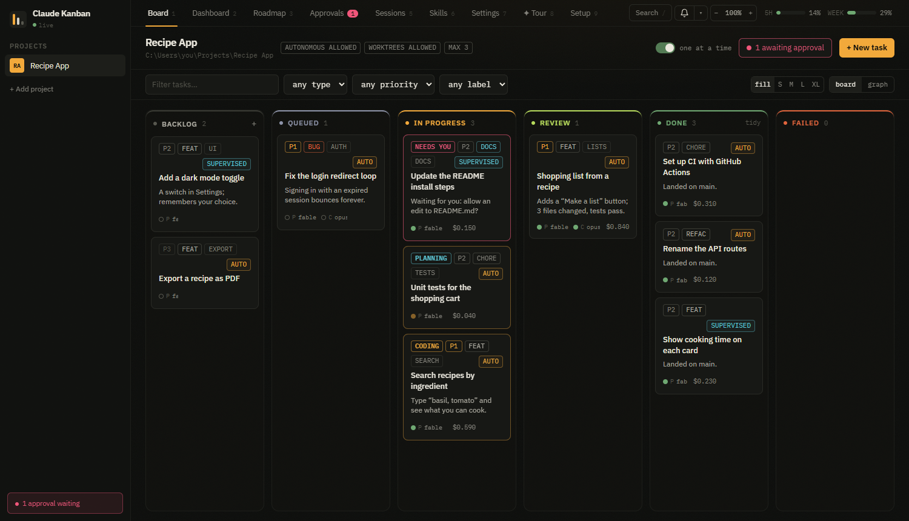
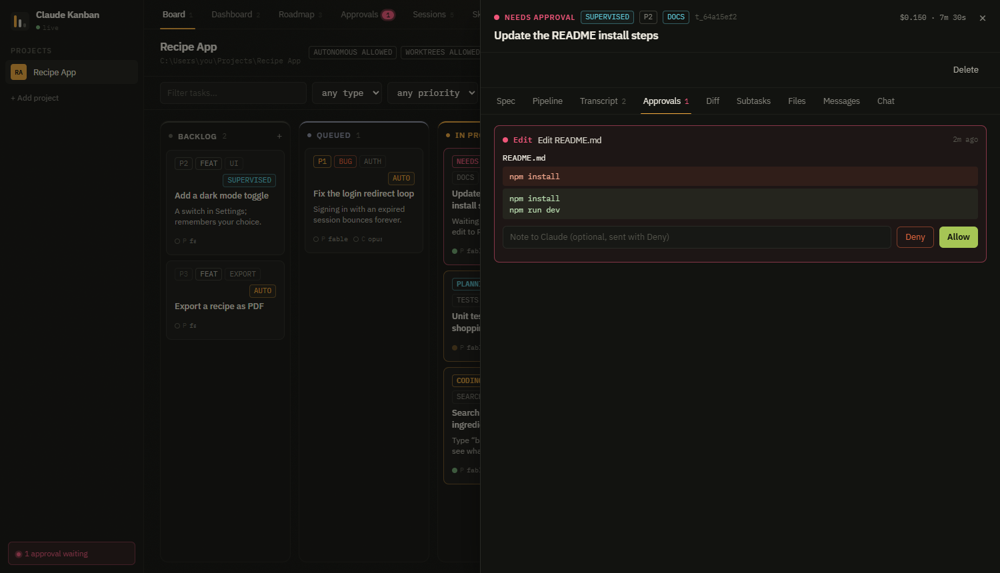
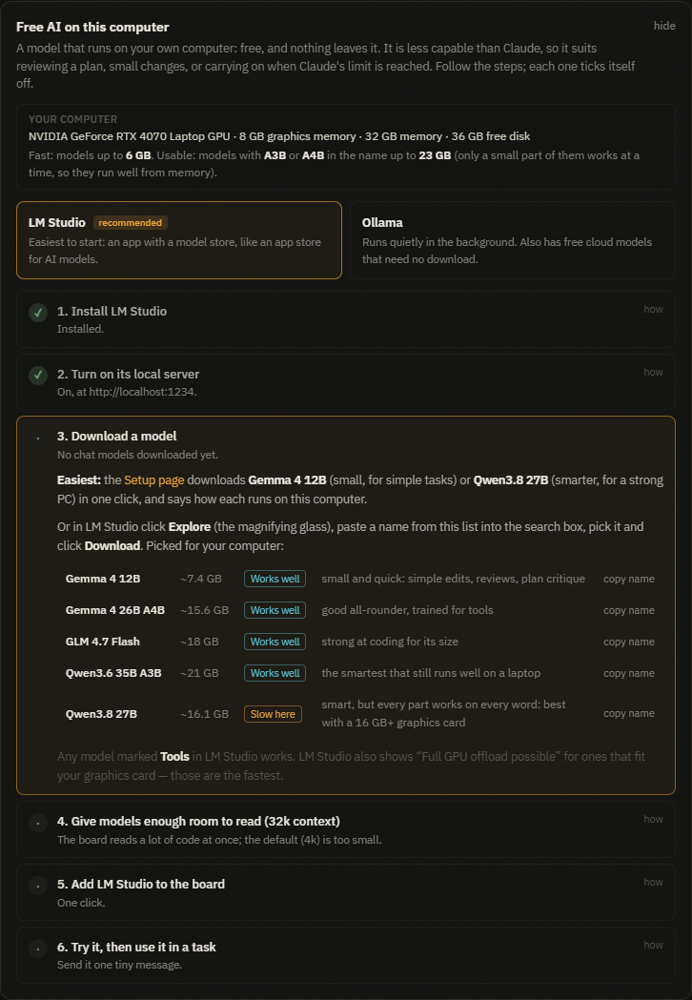

# Claude Kanban

**Give Claude a list of tasks and walk away.** Claude Kanban is a board that runs on your own computer.
Each card is a task; Claude plans it, writes the code, checks its own work, and hands it back for you
to approve — several tasks at once, each in its own safe copy of your project, asking you before
anything risky, and showing exactly what changed and what it cost.

It is built on Claude Code, so it uses your Claude subscription and keeps your skills, plugins and
`CLAUDE.md`. It adds what a terminal cannot give you: many sessions you can see at a glance, work that
lands safely, and an honest record of what everything cost.

**Install on Windows in one line** — see [Install](#install-windows). Free and open source (MIT).



---

## What problems it solves

| If this sounds familiar… | …Claude Kanban does this |
|---|---|
| “I can only watch one Claude session at a time.” | Queue as many tasks as you like; independent ones run **in parallel**. Autonomous tasks each get their own copy of the project (a git worktree), so they never edit the same files. |
| “Claude did something I didn't want.” | **Supervised** tasks turn every file change and command into an **Allow / Deny** card. **Autonomous** tasks work in their own copy and change nothing until you approve the result. Dangerous commands are blocked outright. |
| “The best model for everything is slow and uses up my limit.” | Each task is a **pipeline**: a strong model plans, an efficient one codes, a cheap one reviews. You choose per stage — or use **free local models** (LM Studio, Ollama) and others (OpenRouter, GLM, Kimi…). |
| “I hit my usage limit halfway through and lost the work.” | The task **pauses** and **carries on by itself** when your limit resets, in the same session. |
| “I want Claude to work while I sleep.” | **Schedule** a card for 2 AM, for when your limit resets, or every chosen day. The computer is kept awake while work is waiting, and you wake up to it in Review. |
| “I have no idea what that cost or where the time went.” | Every task shows its **cost, tokens and time**; the **Dashboard** adds it all up. |
| “A big job is too much for one prompt.” | **Improve** turns a rough idea into a clear spec and splits it into subtasks with dependencies; the board runs them in the right order. |
| “Setting all this up is fiddly.” | The **Setup** page checks your computer and fixes what is missing, mostly in one click. |

| Nothing risky happens without you | Free AI on your own computer, set up step by step |
|---|---|
|  |  |

**Who it is for:** anyone with a Claude **Pro or Max** subscription (or an Anthropic API key) who uses
Claude to build things — developers who want to run more at once, and non-developers who want Claude's
work to be safe and easy to review.

## What you need

- **Windows 10 or 11** for the one-line installer and the desktop icon. Mac and Linux work too, from a
  terminal ([see below](#mac-and-linux)).
- **A Claude account**: a Pro or Max subscription, or an Anthropic API key. Tasks use your plan's usage,
  exactly like Claude Code.
- **Node.js 24+** and **Git** — the installer adds them for you if they are missing.
- About 1 GB of free disk space.

## Install (Windows)

1. Open **PowerShell**: press the Start button, type `PowerShell`, press Enter.
2. Paste this line and press Enter:

   ```powershell
   irm https://raw.githubusercontent.com/husseinalnahi-iq/Claude-Kanban/main/install.ps1 | iex
   ```

3. If Windows asks for permission to install **Node.js** or **Git**, click **Yes**.
4. When it says **Done**, the board opens in your browser, and a **Claude Kanban** icon is on your
   **Desktop** and in the **Start menu**.

The line downloads [install.ps1](install.ps1) from this repository and runs it — you can read it first.
It installs Node.js and Git with Windows' own installer (winget) if they are missing, downloads the
board into `C:\Users\<you>\Claude Kanban`, installs its parts, adds the icon, and opens it.

**Rather not paste a command?** Click the green **Code** button at the top of this page →
**Download ZIP**, unzip it (for example into Documents), open the folder and double-click
**`Start Claude Kanban.cmd`**. If Windows asks *“Do you want to run this file?”*, click **Run**; if it
says *“Windows protected your PC”*, click **More info → Run anyway**. The first run installs its parts
and adds the Desktop icon. You need [Node.js 24+](https://nodejs.org/en/download) installed first (it
opens that page for you if not). A ZIP copy does not update itself — the one-line install does.

## Open it

- **Double-click the Claude Kanban icon** on your Desktop (or Start menu → *Claude Kanban*).
- A small window starts minimised in the taskbar — that is the board's engine; leave it running. Your
  browser opens the board at <http://127.0.0.1:4310>. Nothing is on the internet: only you can reach it.
- To stop the board, close that small window. To start it again, double-click the icon.
- To start it when Windows starts, run this once in PowerShell:
  `powershell -ExecutionPolicy Bypass -File "$env:USERPROFILE\Claude Kanban\scripts\create-shortcut.ps1" -Startup`

## Your first task (5 minutes)

1. **Setup** opens by itself the first time. Click **Log in to Claude**, and fill in the name and email
   git should use. When the required items are green, you are ready.
2. **Add a project**: *+ Add project* in the left bar → pick a folder (an existing project, or an empty
   folder for a new one).
3. **Create a task**: the **+** on the *Backlog* column → a title, and a few lines on what “done” looks
   like → *Create task*.
4. **Queue it**: hover the card → **queue**. It moves to **In progress** while Claude plans, codes and
   reviews it; anything that needs you shows as **needs you**.
5. **Review it**: when it reaches **Review**, open the card and look at the changes. **Approve** lands
   them in your project; **Reject** keeps them aside with your note, and you can re-run any stage.

The **Tour** tab explains every feature in a few minutes.

## Let it work while you sleep

- **Start a card later:** when you create a task, pick **Later** (a date and time) or **After reset**
  (when your Claude 5-hour usage window next resets). On an existing card, open it and press
  **⏰ Schedule**. The card waits in Backlog with a clock on it, then queues itself.
- **Repeat:** pick **Repeat**, tick the days and set a time, for example every night at 03:00. Each time,
  a fresh copy of the card is made and queued, so earlier results are never overwritten.
- **See everything that is set:** the **⏰ Schedules** button on the board lists repeating schedules
  (pause, change the days or time, run now, delete) and cards waiting to start.
- **Keep the board open.** Nothing runs while it is closed. If the computer was off at the time, a
  missed schedule runs once as soon as you open the board. **Keep this computer awake** (Settings → Runs
  & limits, on by default) stops the computer sleeping while work is waiting; the screen can still turn
  off.

## Update or remove

- **Update:** run the install line again. Your projects and tasks are kept — they live in
  `C:\Users\<you>\.claude-kanban`, not in the program folder.
- **Remove:** close the board, delete the `Claude Kanban` folder and the two icons. To delete your
  board data too, delete `C:\Users\<you>\.claude-kanban`.

## Privacy and cost

The board runs on your computer and keeps its data there. It has no accounts, ads or tracking. Your
tasks talk to Anthropic through Claude Code, just as Claude Code does on its own — or to another
provider only if you add one. Running tasks uses your Claude plan's usage (or API credit); the board
shows your 5-hour and weekly usage in the top bar and what each task cost.

## If something goes wrong

- **The icon flashes a window and nothing happens:** open the `Claude Kanban` folder and double-click
  `Start Claude Kanban.cmd` — the window stays open and says what is wrong.
- **“Claude Kanban needs Node.js 24 or newer”:** install the LTS version from
  [nodejs.org](https://nodejs.org/en/download), then open the board again.
- **The installer says a program was installed but “this window cannot see it yet”:** close PowerShell,
  open a new one, and paste the install line again.
- **The browser says the page cannot be reached:** the board is not running — double-click the icon.
- **Something is missing or red:** open the **Setup** tab; it checks everything and offers a fix.
- **A scheduled task did not run overnight:** the board has to be open, and the computer awake. A laptop
  can still sleep when its lid is closed: in Windows, Control Panel → Power Options → *Choose what
  closing the lid does* → *Do nothing* (when plugged in).
- **Still stuck?** [Open an issue](https://github.com/husseinalnahi-iq/Claude-Kanban/issues) with what
  the window says.

## Mac and Linux

```bash
git clone https://github.com/husseinalnahi-iq/Claude-Kanban.git
cd Claude-Kanban
npm install
npm start
```

Then open <http://127.0.0.1:4310>. You need Node.js 24+ and Git. Keep the terminal open while you use it.

## Feedback

If Claude Kanban is useful to you, a ⭐ **star** on GitHub helps other people find it. Bugs and ideas
are welcome as [issues](https://github.com/husseinalnahi-iq/Claude-Kanban/issues). Only the maintainer
can change this repository; suggestions arrive as issues or pull requests and are reviewed before
anything is merged.

---

## For developers

Requirements: **Node 24+** (it uses the built-in `node:sqlite`), **git**, and a **Claude login** — a
subscription, or `ANTHROPIC_API_KEY`. The Agent SDK ships its own Claude binary, so installing Claude
Code separately is optional.

**Development** (hot reload, two processes):

```bash
npm install
npm run dev
```

UI on <http://127.0.0.1:5173>, API on <http://127.0.0.1:4310> (REST under `/api`, WebSocket at `/ws`).
`npm start` builds the UI and serves everything from one process on :4310.

```bash
npm test          # db, queue, git, prompts, gate, runner, triage, attachments, guardrails
npm run typecheck
```

State lives in `%USERPROFILE%\.claude-kanban\` — `kanban.db`, `logs\<runId>.log`, and
`attachments\<taskId>\`. Override with `KANBAN_STATE_DIR` / `KANBAN_PORT`.

- Design as agreed: [docs/spec.md](docs/spec.md)
- Every decision with its reason: [docs/DECISIONS.md](docs/DECISIONS.md)
- Verification evidence: [docs/VERIFICATION.md](docs/VERIFICATION.md)

The rest of this page is the full reference.

---

## Setup

The **Setup** tab lists what this computer has for the board's features, in four groups:

- **Required** — Node 24+, a Claude login, git, and git's name and email (approving a task commits).
- **Recommended** — a browser for [browser checks](#browser-checks-and-plugins), while they are on.
  Chrome is used when installed, then Edge (every Windows 11 machine has it), then Playwright's own
  Chromium.
- **Optional** — only for what you have set up: Ollama and each model a provider lists, the agent CLIs
  (Codex, Gemini, Kimi, OpenCode), provider keys, desktop notifications.
- **Good to know** — plugins and skills. No board feature needs one.

Each missing item offers what fits it:

| Button | What happens |
|---|---|
| **Install** / **Save** | The board runs a built-in command and streams its output: `npx @playwright/mcp install-browser chromium`, `ollama pull <model>`, `npm install -g @openai/codex`, or `git config --global` from a two-field form. Nothing you type reaches a shell. |
| **Fix with Claude** | For installs that differ per OS (git, Ollama, Kimi, OpenCode), or when Install failed. A supervised Claude session in a hidden *Setup* project: **every command it wants to run is an approval card**, and it is told to install only this thing and stop at anything needing administrator rights. The row re-checks when the session stops. |
| **Copy** | The usual command for your OS, to run yourself. |

On Windows the board re-reads PATH after every fix, so something just installed works without
restarting it.

## How it works

| Piece | What it does |
|---|---|
| **Projects** | A registered folder plus a policy: whether worktrees and autonomous runs are allowed, and how many tasks may run at once. |
| **Tasks** | Title, markdown spec, mode, pipeline, attached skills, optional parent, milestone and dependencies. |
| **Pipeline** | Each stage is one `query()` with its own model and effort. The prompt carries the spec, the parent, sibling summaries, earlier stage results, project memory, messages and attached files. Plan stages cannot edit files. |
| **Autonomous** | Runs in its own git worktree on `kanban/<taskId>`. Edits are accepted inside it; writes outside it and history-rewriting git commands are refused. **Approve** lands the branch — see *Landing safely*. |
| **Supervised** | Runs in the project folder, and every tool call that needs permission becomes an approval card: Allow or Deny, with a note. |
| **Queue** | Per-project FIFO with a per-project cap and a global cap. Drag between Backlog and Queued. |
| **Board MCP** | Every run gets `board_get_task`, `board_list_siblings`, `board_post_message`, `board_create_subtasks`, `board_set_summary`, `board_remember`, `board_memory`. |
| **Approvals** | A global inbox with `a` / `y` / `n` and a tab-title badge, so an unattended run never stalls unnoticed. |
| **Dashboard** | Needs-you, open, done, spend, median task time, first-pass rate, throughput, cost by model, where runs fail. Every chart has a table view. |
| **Sessions** | Every run across projects: state, model, effort, cost, tokens, elapsed. |
| **Skills** | User, project and plugin skills in one place, each with an on/off switch that applies to every run. |
| **Memory** | One-line decisions per project, injected into later prompts, editable and prunable. |
| **Search** | `/` or Ctrl-K over specs, run results, transcripts, messages and memory. |
| **Usage** | Your 5-hour and weekly Claude windows in the top bar, with reset times. A task stopped by the limit **pauses and resumes by itself** when the window reopens. |
| **Recovery** | On restart, interrupted runs become `failed`; **Retry** resumes the stored session. Paused tasks keep their resume time. Transcripts past the retention window are pruned then — runs, costs and results are kept. |

---

## CLAUDE.md

Settings → **CLAUDE.md** shows what Claude is told about a project before every run — every
instruction file Claude Code reads, in its own order: your personal `~/.claude/CLAUDE.md`, the
project's `CLAUDE.md` (or `.claude/CLAUDE.md`), your `CLAUDE.local.md`, and any `.claude/rules/`.
Claude concatenates them rather than letting one override another, so each one shown reaches every
run. It is **read-only**: the board never edits these files itself.

**Create with /init** / **Improve with /init** runs Claude Code's own `/init` — the real command, not
an imitation. In Claude's words it *"analyzes your codebase and creates a file with build commands,
test instructions, and project conventions it discovers"*, and *"if a CLAUDE.md already exists, /init
suggests improvements rather than overwriting it."*

It runs as a task, so the file arrives the way every change does: as a diff you approve, or — in a
locked-down project — as an approval card. A custom stage whose prompt is a slash command is sent as
that command, so any of Claude's own commands can be a pipeline stage.

### Onboarding

Registering a project sets it up for Claude at the same time. The dialog looks at the folder:

- **It has code** — a checkbox (on by default) queues `/init` right away.
- **It is empty** — a **Bootstrap** checkbox instead, with three fields: the goal, the stack (or let
  Claude choose) and how to verify. One task then sets up a skeleton, a test runner with a smoke
  test, `CLAUDE.md`, and a README, following the **onboarding checklist** in Settings → Runs & limits.
  Edit that checklist once and every future bootstrap follows it. The same button is on the CLAUDE.md
  tab while the folder is still empty.

When either task is approved, the board gives the project a **verify command** if it has none: the
bootstrap reports its own on a `VERIFY:` line, and after `/init` the cheap intake model reads the new
CLAUDE.md for the one command that runs the checks. It never invents one. What it set is posted on the
task and remembered on the project; change it in Settings → Project if it is wrong.

Nothing is added to ordinary runs. Anthropic's guidance is that instruction files stay short and
specific, so the board's job is to get a good `CLAUDE.md` written once, not to prepend advice to
every stage.

## Effort and fast mode

These are Claude's own two speed controls, with Claude's names — the board adds nothing of its own on
top. Each pipeline stage sets both.

**Effort** is how long the model may think:

| Level | Claude's note |
|---|---|
| `low` | Fastest and cheapest |
| `medium` | Reduces token usage |
| `high` | Default on most models — the board's default too |
| `xhigh` | Deeper reasoning at higher token spend |
| `max` | Demanding tasks needing maximum reasoning |

**↯ Fast mode** is *"a high-speed configuration for Claude Opus, making the model up to 2.5x faster at a
higher cost per token."* Same model, same quality, delivered sooner — it does not switch to a smaller
model. Opus 5 and Opus 4.8 only, off by default, and billed as **extra usage**. It is independent of
effort, and Claude's advice is to combine them: fast mode with a lower effort for straightforward work.

Mark a stage ↯ in its pipeline. The board checks whether your account can actually use fast mode —
for free, by reading the session's first message and stopping before any model call — and when it
cannot, the toggle says why rather than silently doing nothing. A ↯ stage moved to a model that does
not support fast mode simply runs at standard speed.

There is no "slow / balanced / fast" setting in Claude; these two controls are what exists.

## Other models: delegation and plan debate

Every stage runs on Claude through your Claude Code login by default. It does not have to. A stage can
run on a cheaper model, a local one, or another coding agent that is better at some kind of work — and
a plan can be argued over by a second model before any code is written. Add providers in **Settings →
Providers**; pick one per stage in any pipeline editor. Keys live in the board's own secrets file
(`<stateDir>/secrets.json`), never in settings, and are redacted from logs. Every provider has a
**Test** button that makes one tiny call through the exact path a stage would use.

Three ways to reach another model, each a different trade-off:

- **Claude Code on another endpoint** (GLM/z.ai, Kimi, MiniMax, OpenRouter, Ollama, LM Studio). The real Claude
  Code, pointed at an Anthropic-shaped API with an environment override. Everything keeps working — the
  board tools, approvals, hooks, worktrees, the transcript — only the model behind the API changes.
  Effort and fast mode are Claude-only, so they are switched off for these.
- **A plain chat API** (OpenAI-compatible: OpenRouter, Ollama, anything). Text in, text out, no tools —
  so it is allowed on **plan and review only**, with the diff or the repository's file list put into the
  prompt. Good for a critique or a second opinion.
- **Another agent's CLI** (Codex, Gemini, Kimi, OpenCode, or a custom command). Runs headless as a
  subprocess in the task's workspace. Read-only by default; turn on "may edit files" only for tasks that
  run autonomously in a worktree, because the board cannot approve or block what another CLI does. Each
  CLI gets an environment allowlist plus its own key, never the board's other secrets.

**Free AI on this computer.** Settings → Providers opens with a step-by-step guide to LM Studio or
Ollama for people who have never run a model locally: download links, where to click, which models
suit this computer (it reads the graphics card, memory and free disk), and a one-click *Add to the
board*. Each step ticks itself off by looking at the machine. The **Setup** page offers LM Studio to
everyone as optional: install instructions, a one-click *Turn on* for its server, and one-click
*Download* of Gemma 4 12B (small, for simple tasks) or Qwen3.8 27B (for a strong PC), each rated for
this computer.

**The model picker asks the provider what it has.** For Ollama that is the models you have pulled
(*on this computer · free*) plus Ollama's whole cloud list (free tier with limits, some models need a
paid plan; a cloud model you have not used yet needs one `ollama pull <id>`, a few KB). For **LM
Studio** (≥ 0.4.1, server on, port 1234) it is what you downloaded, loaded ones first, with size and
quantisation, and a warning when a model is loaded with less than the 32k context Claude Code needs.
For OpenRouter it is the whole list, split into *Free* and *Paid* with the price per million tokens
and the context size. Type to filter, or type any id to use it as it is. Other providers show the
models you listed.
The provider dropdown's last entry, **+ Add a provider**, opens Settings → Providers in a new tab.

**Cost** for a non-Claude model is estimated from the prices you enter (USD per million tokens) and
labelled *est.*; with no price of yours, a model picked from OpenRouter's list uses OpenRouter's price.
A model with no price at all is shown as *subscription* — $0, with the tokens still counted.
The board meters each stage itself against the per-stage ceiling, since the SDK cannot price a model id
it does not know. A foreign provider's rate limit fails the task rather than pausing it — the pause
timer is tied to Claude's own usage windows.

**Plan debate** (Settings → Models, or per stage) sends a finished plan to a second model, which lists
its objections; the planner then answers each and revises. The task stops and shows you the original
plan, the objections, and the revised plan side by side — nothing runs until you pick one (or write your
own). One round, because an unbounded argument just spends money.

## Intake: the board decides how to run a task

Press **Improve** on a rough request and Claude rewrites it into a proper spec — Problem, *Done when*
as testable checks, Out of scope, how to Verify — and makes two decisions for you, each with a reason.

**One task or several.** Splitting is not free: every subtask runs its own pipeline, so three subtasks
cost roughly three times one task. It defaults to one, and anything under three genuinely separable
pieces collapses back. When it does split, each subtask declares the files it will touch.

**Which pipeline this deserves.** Most work does not need three stages on the strongest model:

> **Claude sized this task** `code haiku-4-5/low`
> *Straightforward find-and-replace of a year value in the footer — no complex logic, no multiple
> files, no architectural decisions needed.*
> now: plan fable-5-1/high → code opus-5/high → review sonnet-5/medium **[Use it] [Keep default]**

Nothing is applied until you press **Use it**. It costs nothing extra — the proposal comes back in the
same cheap intake call that classifies the task. The model picks a **tier** (cheap / balanced /
strong), never a model id, so it cannot invent one; what each tier means is three dropdowns in
Settings.

New tasks are also classified automatically (type, labels) when Claude is confident. Priority is only
ever *suggested* — a wrong label is worse than no label.

---

## Running tasks together, or in order

Subtasks declare the files they touch, and **any two whose files overlap are given a dependency
automatically** — two sessions never edit the same file at once. Everything else runs in parallel, up
to the project's concurrency cap. A task whose dependencies are not done cannot be queued, and each
one finishing releases whatever it was blocking; set **auto-queue** on the parent and the plan drains
on its own.

Switch the Board to **graph** to see and change the wiring. Columns are waves — everything in one
column can run together — and arrows point one way only. Drag the ● on a card's edge onto another card
to make it wait; click an arrow twice to remove it. Loops, self-links and cross-project links are
refused by the server: a cycle is not a workflow, it is two tasks waiting for each other.

The parent's **Subtasks** tab is a checklist — progress, what each blocked child is waiting for, and
**Queue N ready** for the ones that can start now.

### One at a time

The **one at a time** switch in the board header runs a single task from end to end — it finishes and
commits before the next one starts — so a long backlog spends your Claude limit slowly instead of all
at once. It applies to every project, and it overrides the caps rather than overwriting them: turn it
off and your numbers come back. New boards start with it on; an existing board keeps the settings it
already had until you flip it.

**Run now** on a card starts that one task beside whatever is already running, outside the caps, for
when something is urgent. Settings → Runs caps how many forced runs may pile up.

When a run hits your Claude usage limit the whole queue waits for that window rather than feeding the
next task into the same wall — but stages **delegated to another provider keep running**, because the
limit is Claude's, not theirs. The board says so in a line under the header, with the time the window
reopens. Forcing a task does not skip this: it would only pause a moment later.

---

## Landing safely

Two tasks with their own worktrees cannot overwrite each other *while* they work. The risk is the
moment they land, and that is what Settings → *Git & merging* controls. Approving does, in order:

1. **Refuses** if your checkout has uncommitted changes, or is on a branch other than the base.
2. **Pulls the base into the task's worktree.** The important one: a conflict happens *there*, where
   the session that wrote the code can fix it, and your checkout is never left mid-merge. It also
   makes the final merge a fast-forward that cannot conflict.
3. **Re-runs the verify command** on the combined result — "it passed before the other task landed" is
   not "it passes now". Skipped when the tree has not changed since it last passed.
4. **Lands it**, one task at a time per project: a merge commit (default), a rebase, or a squash.

If the base genuinely conflicts, the default is to stop and name the files, with nothing merged. Set
*Give it back to Claude* and the session that wrote the code resolves it in its own worktree and
re-verifies — you still approve the result. A failed merge is always undone with `git merge --abort`,
never `reset --hard`; if that abort fails, the board says so and stops rather than guessing.

A task open for a while shows **"N commits landed on main since this started"** with an *Update it*
button, so it can catch up while that is still cheap.

**Locked-down projects.** A repository whose own rules say *main branch only, every write approved* is
registered with the **Supervised-only preset** (`worktrees: forbidden, autonomous: forbidden`). The
board then refuses to queue an autonomous task there — HTTP 409, with the policy named — and the New
task form disables the option. The board obeys such rules and never edits them.

---

## Files and artifacts

Attach images, PDF, Word, Excel, PowerPoint, CSV or text to a task: drop, paste (Ctrl-V) or pick, up
to 10 MB. What the run gets depends on the file, and in every case it should not have to pay to look:

- an **image** is described once by a cheap vision model, and the words go into every stage's prompt;
- **text and CSV** carry their own first few KB as a preview, written on upload with no model call;
- a **spreadsheet or document** is named with its path, and the stage is told to open it with a script
  rather than guess at the contents.

The path is always there too, so a stage can read the file when the summary is not enough.

**Which model looks at images** is set in Settings → Models & pipeline → *Intake models*. The default
is **Claude Haiku 4.5 at low effort** — Claude's cheapest model that can see, well under a cent per
screenshot — sent the image directly with a short brief and none of your MCP servers or plugins, so
nothing else is paid for. Any provider whose model can see works too: Kimi or GLM through Claude Code,
a vision model on OpenRouter, Ollama or LM Studio (free, local), or the Codex and Gemini CLIs (your
ChatGPT or Google plan). **Try it** shows it a sample screenshot first. If the model you picked cannot
describe an image, Claude's default does it instead; each file says which model saw it.

The same tab collects what the sessions **produced** — reports, pages, spreadsheets, diagrams,
screenshots — copied into the board's storage so they outlive the worktree. Click one to open it: CSV
renders as a table, HTML renders as a page, text as text, anything else downloads. Source files are
not collected; those are in the Diff.

Everything except a bitmap image is served as a download with `nosniff`, and HTML previews render in a
sandboxed frame with scripts disabled — a generated page can never run in the board's own origin.

---

## Browser checks and plugins

Settings → **Browser & plugins**.

**Browser checks** (on by default) let a run look at what it built, the way Claude Code does. Each
session gets its own Playwright browser: headless, so no windows open over your work; isolated, so two
tasks running at once do not fight over one browser profile; and writing its page snapshots outside
the project, so none of them get committed. When a change affects something you can see, the code stage
starts the app on the task's own port (`$KANBAN_PORT`), takes a screenshot and fixes what looks wrong.
The review stage then looks for itself before approving. The screenshots land in the task's **Files**
tab. A change with nothing visible skips all of it, so a backend task pays nothing.

| In the browser | Autonomous | Supervised |
|---|---|---|
| Open a local page, screenshot, read the console | yes | yes, no card (nothing changes) |
| Click, type, fill forms on a local page | yes | approval card |
| Open any other site | refused | approval card |
| Run custom browser code, upload files | refused | approval card |

**Claude in Chrome** (off by default) is your own Chrome, signed in to your accounts. When switched on,
supervised tasks can use it for checks that need your login, with every action approved. Autonomous
tasks never get it, whatever the setting says.

**Plugins**: runs load your Claude Code plugins, not just their skills. That covers their slash
commands, subagents, hooks and tool servers, exactly as in Claude Code ("Load your global plugins" in
*Runs & limits*). **What runs get** lists them, read from a real session that is stopped before Claude
is called, so the check costs nothing. Next to each tool server it shows how the board treats it. Your
claude.ai connectors (Gmail, Slack, Drive…) appear there too: autonomous runs are refused them, and
supervised runs ask you before every call.

---

## Guardrails

What stops an unattended run from doing damage, in Settings → *Runs & limits*:

- **Blocked commands** — refused outright in both modes, *before* any approval card, because for
  `DROP DATABASE` or `rm -rf /` a card is just a chance to click the wrong button. Matching normalises
  quoting and pipes, so `curl … | sudo bash` is caught while `rm -rf ./build` is not.
- **Never kill by name** — `taskkill /IM node.exe`, `pkill`, `killall`, `Stop-Process -Name` are refused
  in both modes and cannot be switched off. A real run once "stopped its dev server" that way and took
  every Node process on the machine with it, the board included. Killing your own PID is fine, and the
  board itself stops whatever a stage leaves running on its reserved port.
- **A per-task cost ceiling** on top of the per-stage one. Three stages at $5 was already $15. Reaching
  either ceiling **pauses the task and asks you** — *Continue* lets it spend one more stage's worth in the
  same session; *Stop* keeps what it did. Nothing is thrown away for money.
- **Loop detection** — a stage repeating the same tool call is stopped and the reason recorded.
- **Run ceilings** — max turns and cost per stage, and a bounded blast radius for subagents.
- **Desktop notifications** when a task needs approval, is ready for review, or fails.

---

## Usage limits and auto-resume

Your Claude windows are in the top bar — **5-hour and weekly, with the percentage used** — so you
never have to open Claude to know whether you can start something. Click them for the full panel:
each window's usage, when it resets (*"resets in 2h 36m · 23:50"*), how fresh the numbers are, and
every task waiting on the window.

They are your **whole subscription's** numbers, read from your account the same way Claude Code's
`/usage` reads them. That covers everything you use: Claude Code, claude.ai, other machines, not just
the board's runs. The board refreshes them when it starts and every 5 minutes, and **Check now**
refreshes them on the spot. No message is sent, so none of this costs anything. The SDK marks this
read as experimental. If it ever stops working, Check now falls back to one tiny paid call (about
two cents).

**When a window runs out mid-task, the task pauses instead of failing.** It stays in **In progress**
with a *paused · limit* badge and *"resumes in 2h 13m · 23:52"*, and when the window resets it continues by itself — in
the same session, from the stage it was on, so nothing already finished is done again. It picks up
just after the reset, not before, so it does not walk straight back into the limit; a paused task
survives a restart of the board; and **now** on the card tries immediately if you would rather not
wait. A genuine error is never disguised as a pause — only a usage limit pauses. Turn it off in
Settings → *Runs & limits* and a limit fails the task as before, for you to Retry.

## Schedules

A card can carry a **scheduled start** (`start_at`): an ISO time, or `reset` for the next reset of the
5-hour window plus the same 90-second margin auto-resume uses. A **repeating schedule** is a template
(title, spec, mode, pipeline, skills) with days of the week and an `HH:MM` time in the computer's
local time; each time it comes round it creates a fresh card, titled with the date, and queues it.

- One scheduler ticks every 20 seconds rather than setting exact timers. A minute's accuracy is
  plenty, and a tick survives sleep, clock changes and restarts without any bookkeeping.
- Everything goes through the normal queue, so caps, dependencies, usage limits and approvals all
  apply. A card that cannot start (blocked by a dependency, say) keeps a note saying why and loses its
  schedule rather than being retried forever.
- Missed runs are caught up **once**: the next run is always worked out from now, so three nights
  with the computer off make one card, not three. A card started by hand drops its scheduled start.
- **Keep awake** holds the operating system's own sleep inhibitor while anything is queued, running
  or scheduled: `SetThreadExecutionState` on Windows, `caffeinate` on macOS, `systemd-inhibit` on
  Linux. The helper process watches the board's process and exits with it, so a crashed board never
  leaves the computer unable to sleep.
- API: `POST /api/tasks/:id/schedule`, `GET /api/projects/:id/schedules`, `POST /api/schedules`,
  `PATCH` / `DELETE /api/schedules/:id`, `POST /api/schedules/:id/run`.

## What a task costs

Click the cost figure on a task for the breakdown: input and output tokens, cost and time **per
stage**, and an approximate share of your **five-hour subscription window**.

A task that hits a ceiling shows **needs you · cost** in rose on the board, with what it spent so far.
**Continue** on the card, or in the task, carries on from the same session with one more stage's worth
of budget; **Stop** keeps what it did and marks it failed so Retry still works later.

Two currencies, on purpose. The dollar figure is the SDK's estimate of equivalent API price — good for
comparing stages, but **not a bill**, because runs go through your Claude subscription. The window
percentage is what can actually stop you working; it is measured from what the CLI reported before and
after each stage, so it appears only where the CLI said something, and it says *not measured* rather
than inventing a number.

**Where the tokens actually go** — measured, not estimated:

| | tokens per stage |
|---|---|
| Claude Code preset | ~39,000 |
| Your global plugins, hooks and skills | ~5,400 |
| The board's own stage prompt | ~1,750 |
| **Total** | **~44,500** |

The prefix is cached: a warm stage **reads ~34,700 of those at a tenth of the price** and writes only
~6,800. So the levers that matter are the number of stages and what is loaded into each one — not the
prompt text.

Ways to spend less, in order of effect: accept the right-sizing proposal; turn off *Load your global
plugins, hooks and skills into runs* (~12% of every stage — project settings and `CLAUDE.md` still
load); cheaper models and lower effort per stage; switch unused skills off.

---

## Sessions: continue one, or start a new task?

Each stage is its own session. Within a task, stages hand results forward and the **Chat** tab resumes
the latest one, so you can say "also rename that variable" while the work is fresh.

**While a stage is running, Chat still works.** Type on the Chat tab and the message is handed to Claude
at its next step — it does not stop, and nothing already done is redone. Use it for "use the header's
blue", "skip the tests for now", "also rename that". Your message appears in the transcript, so you can
see it was read. Stages delegated to another provider's CLI or HTTP API cannot take a message mid-run;
the box says so.

**Days later, use ↪ Follow-up task instead.** An autonomous task's worktree is deleted when you
approve it, so its session has no working directory to resume into; the repository has moved on; and
the SDK's own guidance is to capture results into a fresh session rather than resume. Follow-up does
exactly that: the new task's spec opens with what the old one did, the files it changed, and an
instruction to start from the repository as it is now, with both tasks linked.

*Same task, same day → Chat. New symptom, later → Follow-up task.*

---

## Welcome and the Tour tab

The first time the board opens on a machine it says hello: six headline features, and a demo card
walking across a pretend board in the real status colours. The **Skip** button is shy. It slides away
from your mouse twice, then gives up with a 😂 and lets you click it. From the keyboard, Enter or Esc
closes it straight away.

**✦ Tour** (key `8`) is the long version: every feature, why it beats doing the same by hand, and a
link to where it lives. It also has a three-step start, the keyboard shortcuts, and the demo with the
real event sounds. **↺ Replay the welcome** opens the pop-up again.

---

## Appearance

The whole interface scales with the **−/+ control** in the top bar (85–150%, or Ctrl + − / = / 0).
The board's columns are **Backlog, Queued, In progress, Review, Done** and **Failed**. In progress is
always there; each card in it says whether it is *planning*, *coding*, *reviewing*, *needs you* or
*paused · limit*, and whatever needs you sits at the top. Board columns default to **fill**, sharing
the window evenly; fixed widths are there if you would
rather have narrow cards and scroll sideways. Both are stored per machine. Anywhere the board offers a
choice you might not know the words for, there is a **?** that explains it on hover.

---

## Notifications and sounds

The **bell** in the top bar mutes and unmutes; its **▾** opens the panel. Every kind of event has its
own sound and its own colour — the colour the board already uses for that state, so a rose pop-up means
what a rose card means:

| Event | Colour | Sound |
|---|---|---|
| Needs your approval | rose | knock, knock… ping — and the pop-up stays until you deal with it |
| Ready for review | lime | a rising chime |
| Landed | moss | a sparkle, with a little confetti |
| Failed | rust | two notes falling |
| Paused by usage limit / Resumed | iris | a slide down / back up |
| Started | amber | a light tick (silent by default) |
| Usage getting high (80%, 95%) | amber | beep, beep, lower |
| All clear — nothing running, queued or waiting | cyan | a small fanfare |

Three voices for the same sounds — **Chimes**, **Arcade** and **Soft** — a volume slider, and for each
event a switch for its sound, its pop-up and its desktop notification (sent only while the board is in
a background tab). **▶** next to an event plays it with its pop-up; **♪ Play them all** plays the whole
set in ten seconds. The sounds are synthesised in the browser: no audio files.

Pop-ups open their task on click and merge when they come together ("×3 tasks started"). While you are
in another tab, the tab's icon and title take the colour of the most urgent thing you missed. The
board learns the current state when it opens, so a reload never replays old news. Browsers only
allow sound after you have clicked somewhere on the page once.

---

## Using it on a second machine

The board is per-machine: `kanban.db` lives in `%USERPROFILE%\.claude-kanban`, and projects are
absolute paths on that machine.

```bash
git clone <your remote> Claude-Kanban
cd Claude-Kanban
npm install
claude auth login
```

What syncs through git is the app; what does not is the board's contents and its worktrees. Do not
point `KANBAN_STATE_DIR` at a syncing folder to "share" a board — SQLite corrupts when two machines
write to it. A genuinely shared board is a roadmap item.

---

## Roadmap

- AI roadmap generation, and an ideation board
- Changelog from finished tasks
- GitHub / Linear import
- Electron wrapper, and a `claude://` deep link into Claude Desktop
- One shared board across two machines
- Triggers from outside the board (a chat message, a repository event) and scheduled recurring tasks
