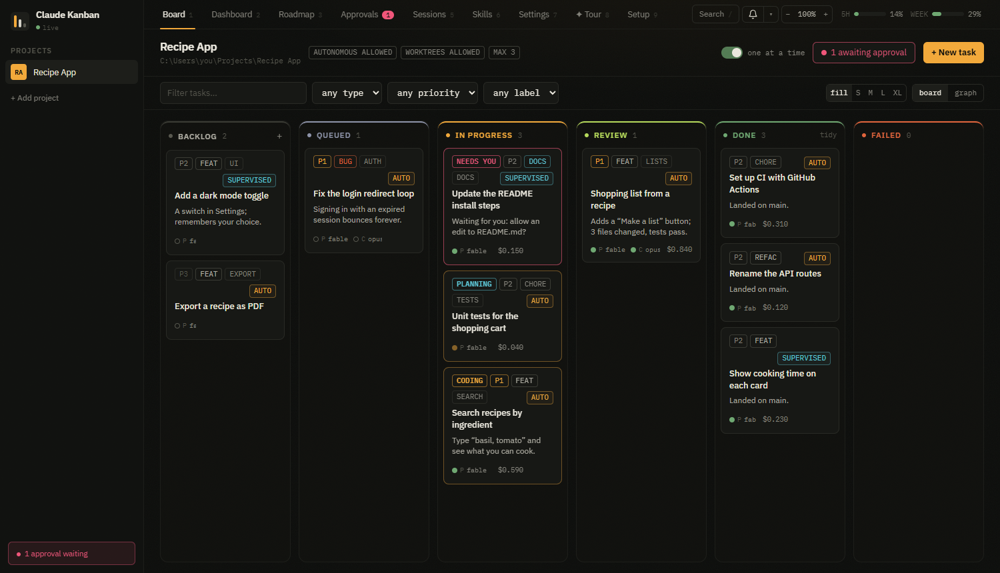
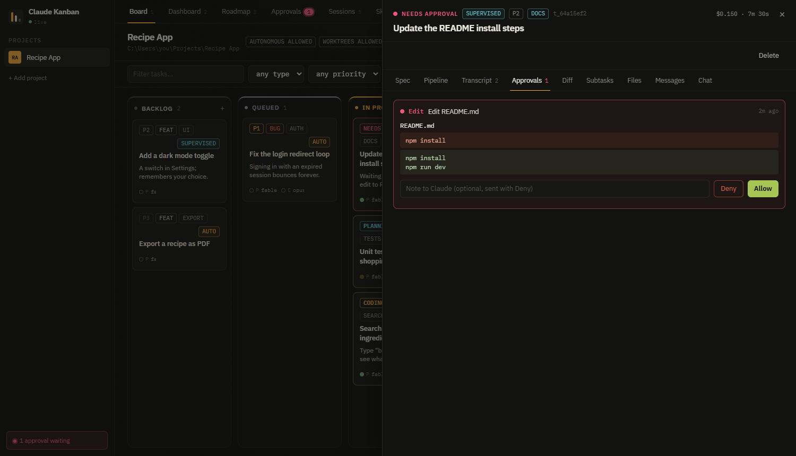
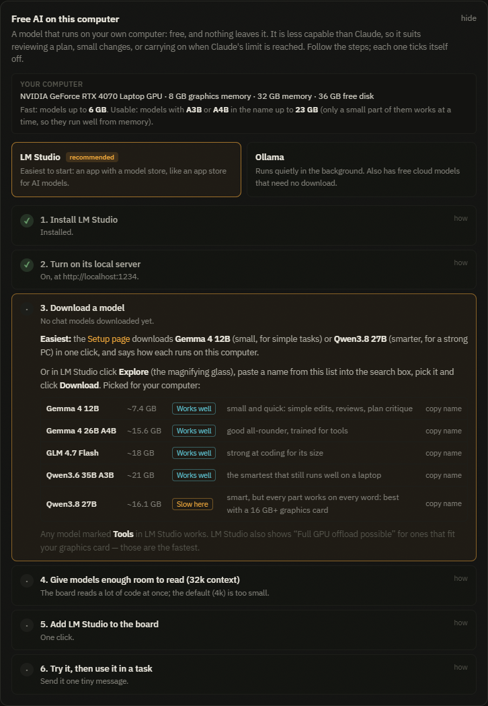

# Claude Kanban

**Give Claude a list of tasks and walk away.** Claude Kanban is a board that runs on your own computer.
Each card is a task; Claude plans it, writes the code, checks its own work, and hands it back for you
to approve — several tasks at once, each in its own safe copy of your project, asking you before
anything risky, and showing exactly what changed and what it cost.

It is built on Claude Code, so it uses your Claude subscription and keeps your skills, plugins and
`CLAUDE.md`. It adds what a terminal cannot give you: many sessions you can see at a glance, work that
lands safely, and an honest record of what everything cost.

**Install on Windows in one line** — see [Install](#install-windows). Free and open source (MIT).



---

## What problems it solves

| If this sounds familiar… | …Claude Kanban does this |
|---|---|
| “I can only watch one Claude session at a time.” | Queue as many tasks as you like; independent ones run **in parallel**. Autonomous tasks each get their own copy of the project (a git worktree), so they never edit the same files. |
| “Claude did something I didn't want.” | **Supervised** tasks turn every file change and command into an **Allow / Deny** card. **Autonomous** tasks work in their own copy and change nothing until you approve the result. Dangerous commands are blocked outright. |
| “The best model for everything is slow and uses up my limit.” | Each task is a **pipeline**: a strong model plans, an efficient one codes, a cheap one reviews. You choose per stage — or use **free local models** (LM Studio, Ollama) and others (OpenRouter, GLM, Kimi…). |
| “I hit my usage limit halfway through and lost the work.” | The task **pauses** and **carries on by itself** when your limit resets, in the same session — or carries on with another provider you picked. The same goes for a GLM, Kimi or Qwen plan that runs out. |
| “I just want to talk about my project and have the tasks written for me.” | The **✦ Chat** panel answers questions about your code and turns what you want into task cards, which you start or schedule. It reads, and never changes code by itself. |
| “Claude guessed at a choice only I could make.” | When a decision really needs you, Claude **asks**: the card shows *asks you* with options to pick. It waits for your answer, or decides after a time you set. |
| “I want Claude to work while I sleep.” | **Schedule** a card for 2 AM, for when your limit resets, or every chosen day. The computer is kept awake while work is waiting, and you wake up to it in Review. |
| “I have no idea what that cost or where the time went.” | Every task shows its **cost, tokens and time**; the **Dashboard** adds it all up. |
| “A big job is too much for one prompt.” | **Improve** turns a rough idea into a clear spec and splits it into subtasks with dependencies; the board runs them in the right order. Chain any tasks yourself with **Starts after**: queue them all, and each starts when the ones before it are done, with their results. |
| “Setting all this up is fiddly.” | The **Setup** page checks your computer and fixes what is missing, mostly in one click. |
| “The page needs a hero image and I have none.” | Once Codex is linked, a task **makes the pictures it needs** on the ChatGPT plan you already pay for, and saves them into the project. Your own Claude Code can have the same tool. |

| Nothing risky happens without you | Free AI on your own computer, set up step by step |
|---|---|
|  |  |

**Who it is for:** anyone with a Claude **Pro or Max** subscription (or an Anthropic API key) who uses
Claude to build things — developers who want to run more at once, and non-developers who want Claude's
work to be safe and easy to review.

## What you need

- **Windows 10 or 11** for the one-line installer and the desktop icon. Mac and Linux work too, from a
  terminal ([see below](#mac-and-linux)).
- **A Claude account**: a Pro or Max subscription, or an Anthropic API key. Tasks use your plan's usage,
  exactly like Claude Code.
- **Node.js 24+** and **Git** — the installer adds them for you if they are missing.
- About 1 GB of free disk space.

## Install (Windows)

1. Open **PowerShell**: press the Start button, type `PowerShell`, press Enter.
2. Paste this line and press Enter:

   ```powershell
   irm https://raw.githubusercontent.com/husseinalnahi-iq/Claude-Kanban/main/install.ps1 | iex
   ```

3. If Windows asks for permission to install **Node.js** or **Git**, click **Yes**.
4. When it says **Done**, the board opens in your browser, and a **Claude Kanban** icon is on your
   **Desktop** and in the **Start menu**.

The line downloads [install.ps1](install.ps1) from this repository and runs it — you can read it first.
It installs Node.js and Git with Windows' own installer (winget) if they are missing, downloads the
board into `C:\Users\<you>\Claude Kanban`, installs its parts, adds the icon, and opens it.

**Rather not paste a command?** Click the green **Code** button at the top of this page →
**Download ZIP**, unzip it (for example into Documents), open the folder and double-click
**`Start Claude Kanban.cmd`**. If Windows asks *“Do you want to run this file?”*, click **Run**; if it
says *“Windows protected your PC”*, click **More info → Run anyway**. The first run installs its parts
and adds the Desktop icon. You need [Node.js 24+](https://nodejs.org/en/download) installed first (it
opens that page for you if not). A ZIP copy does not update itself — the one-line install does.

## Open it

- **Double-click the Claude Kanban icon** on your Desktop (or Start menu → *Claude Kanban*).
- A startup screen shows what it is doing — the first time it installs its parts, which takes a minute
  or two — then your browser opens the board at <http://127.0.0.1:4310>. Nothing is on the internet:
  only you can reach it.
- The board keeps running with an icon **by the clock** (on Windows 11 it may be under the **^** arrow;
  drag it onto the taskbar to keep it in sight). Closing the browser tab leaves it working. Click the
  icon to open the board again; right-click it for **Show log**, **Restart** and **Quit Claude Kanban**.
  Restart and Quit ask first when a task is working.
- To start it when Windows starts, run this once in PowerShell:
- To start it when Windows starts, run this once in PowerShell:
  `powershell -ExecutionPolicy Bypass -File "$env:USERPROFILE\Claude Kanban\scripts\create-shortcut.ps1" -Startup`
- `Start Claude Kanban.cmd` in the folder still starts it the old way, in a window that shows everything
  it prints — handy when something goes wrong. The icon opens `Claude Kanban.exe`, a small program
  built on your computer by Windows' own C# compiler the first time the board starts (nothing is
  downloaded for it); where it cannot be built, the icon opens the `.cmd` instead.

## Your first task (5 minutes)

1. **Setup** opens by itself the first time. Click **Log in to Claude**, and fill in the name and email
   git should use. When the required items are green, you are ready.
2. **Add a project**: *+ Add project* in the left bar → pick a folder (an existing project, or an empty
   folder for a new one).
3. **Create a task**: the **+** on the *Backlog* column → a title, and a few lines on what “done” looks
   like → **Create & queue** (or **Create** to keep it in Backlog for later).
4. **Watch it**: it moves to **In progress** while Claude plans, codes and reviews it; anything that
   needs you shows as **needs you**. If a stage cannot do the work from where it runs — an autonomous
   run needs a live system it is sandboxed from, say — the card says **blocked · needs you** with the
   reason, and **Switch to supervised & run** carries on from that stage.
5. **Review it**: when it reaches **Review**, open the card: the **Result** is on top, with the review's
   verdict. **Approve** lands the changes in your project; **Reject** keeps them aside with your reason,
   which the next run is told first. You can re-run any stage.

The **Tour** tab explains every feature in a few minutes.

**Wrote it in a hurry?** Open the card and press **✦ Rewrite** on its Spec. Claude (Opus, by default)
reads the part of your project the request is about, then rewrites it into a clear spec: which files are
involved, what “done” means as checks you can test, and how to verify it. Your own text is always kept:
**↩ Back to yours** puts it back, **Try another model** rewrites your words again with a different model
or focus, and **Versions** lists every version to preview or reuse.

## Ask about your project

Press **✦ Chat** in the top bar (or the **c** key). A panel slides in beside the board: ask how
something works, what to do next, or ask for something to be done. Claude answers from your project
when it can; for anything else it makes a **task card** and says so — it never tells you what it
cannot do.

- **"Get me the latest purchase order."** — a lookup becomes an **answer card**: one step on Sonnet
  that reads and reports, changes nothing, runs supervised, and starts at once. Related lookups share
  one card. When it finishes, the answer is posted into the chat by itself, and Claude's next reply
  already knows it.
- **"Make the header sticky."** — a change becomes a card on the board's usual stages. Claude says how
  it will run, **supervised** (asks you before each change; needed for anything that reaches a live
  system) or **autonomous** (on its own branch, lands when you approve), and waits for your go-ahead.
- **"Use Sonnet, high effort, for the code."** — name a model and effort for any stage, in words
  (opus, sonnet, haiku, "Sonnet 5.5"), when the card is made or later while it is in Backlog.

Each card shows up in the chat as it is now, not as it was when the message was written: queued,
coding 3/7, needs you, done. While it is in Backlog you can switch its mode, change a stage's model,
take or turn down Claude's suggestions (is it a live system? which models?) and press **▶ Start**.
A command waiting for your OK shows **Allow / Deny** right there; a failed card shows **Retry**; a plan
waiting for you has **Read the plan**; a question it asks comes with its options as buttons. The
cards from the chat that are still going sit above the message box, so one waiting on you is never
scrolled out of sight.

It also follows your tasks and talks to them for you:

- **"What is each task doing?"** — it looks at the board and tells you: which stage each card is on,
  what it has done so far, what it has cost, and whether one is waiting on you with a question.
- **"Tell the login task to use the blue from the header."** — it passes your words to that task's own
  Claude session. A running task takes them in at its next step; one that is in review or failed picks
  its session up again with them.
- **"Answer it: the second option."**, **"stop it"**, **"run the failed one again"** — it does that too.

Approving, landing or discarding a task's work stays yours: Claude in the chat never does those.

- **Several chats** per project: **+ New** starts one, the title at the top switches between them,
  and **archive** tucks one away (restore or delete it from *Archived*).
- It uses **Sonnet at medium effort** by default — a good balance of quality and price for questions.
  Switch model or effort per chat at the bottom of the panel, or change the default in Settings →
  *Side chat*. Each chat shows what it has cost.
- **Other models in the chat**: a provider that runs Claude Code on its own model (GLM, Kimi, Qwen,
  MiniMax, OpenRouter, Ollama, LM Studio — Settings → Providers) shows in the chat's model list after
  Claude. Switching starts a fresh conversation that is handed the last 20 messages, so nothing said is
  lost. Codex and Gemini cannot run the chat (they are not Claude Code), but cards the chat makes can
  use them.

## Watch a task use the browser

When a task changes something you can see, it opens your app in its own background browser to check
it. While it does, its card shows a pulsing **live** chip: click it (or open the task's **Browser** tab)
to watch the page as Claude clicks, types and scrolls, with what it is doing written underneath. After
the run, the last picture stays; every screenshot it took is in the **Files** tab. Nothing pops up over
your work, and the picture is streamed only while you are watching. Switch it off in Settings →
*Browser, images & plugins* → *Live view*.

## Claude Code and Claude Kanban

| | Claude Code | Claude Kanban |
|---|---|---|
| Read and change files, run commands | yes | yes — every task, with approval cards in supervised tasks |
| A terminal you type in | it is one | **Terminal** panel (Ctrl + \`) |
| Chat about the project | yes | **✦ Chat** — reads code, writes task cards |
| Claude asks you mid-task | yes | yes — a question card on the task |
| Test your app in a browser | Playwright plugin | built in, one browser per task, and you can **watch it live** |
| Use your signed-in Chrome | Claude in Chrome | supervised tasks, every action approved (Settings → Browser, images & plugins) |
| Make an image | an MCP server you find and set up | built in, free, nothing to sign up for — and one line gives Claude Code the same tool |
| Your skills, plugins, hooks, CLAUDE.md | yes | loaded into every run |
| Many sessions at once, costs, schedules, safe merging | — | what the board is for |
| Control other desktop apps | — | not built: a board that can click anything on your PC is a risk it does not take |

## Your terminal

**Terminal** in the top bar (or **Ctrl + `**) opens a real terminal under the board, already in the
project's folder — PowerShell on Windows, your usual shell on a Mac or Linux. **+** opens another tab;
**Terminal here** on a task opens one in that task's own copy of the project, so you can run or try
exactly what Claude built. Hiding the panel keeps your shells running; **×** on a tab ends one. It is
your terminal, not Claude's: commands you type are not checked or blocked by the board.

On Windows it is ready for everyday tools out of the box: `npm` and `npx` work even where Windows
blocks scripts (the terminal's own shell allows them; no system setting changes), and accented
letters and other scripts display correctly. **Setup** lists what makes it better: *The built-in
terminal* (with a one-click **Repair** if its terminal part is missing) and, optionally,
**PowerShell 7** — one click installs it, and new terminals use it straight away.

## Answer Claude's questions

Sometimes only you can make a call: which design, which of two approaches, what a vague request
meant. In a **supervised** task Claude then stops and asks. The card shows **asks you**, the bell rings, and the question
appears in the task (and on the **Approvals** tab) with options to pick; you can also type your own
answer. **Let Claude decide** hands it back. By default the task waits for you, however long it takes.
To keep night work moving instead, Settings → Runs & limits → *When Claude asks you a question* lets
Claude decide after 15 minutes to 4 hours; it says what it chose in its summary.

An **autonomous** task never stops to ask — nobody is watching it. It puts the question on the card
with the answer it is going with, and carries on; answer it there and the next stage gets your answer.

## Approve the plan first, and mark live tasks

A wrong plan is cheapest to fix before any code is written. Turn on **Settings → Runs & limits → Wait
for my approval after every plan** and every task (supervised or autonomous) stops after its Plan stage:
the card says **approve plan**, and the task shows the plan with **Approve plan**, **Edit, then approve**,
and **Send back with a note** (the planner reads your note first on the next run). Each task can follow
Settings, always wait, or never wait — its **Pipeline** tab, or *Safety* when you create it.

Tick **Touches a live system** on a task that changes real data — a production database, a live business app, a
deployed site. It gets a **prod** chip, always waits for plan approval, every stage is told to dry-run
and read back each live change, and its review runs on *Settings → Review model for live tasks* (Opus by
default) and checks the live system itself instead of trusting the summary. When a new task reads like
live-system work, the board offers **Mark it live** on the card; nothing changes until you click it. A task that
only *reads* a live system — a lookup, a count, a report — is not offered as live and is not pushed to the
strongest model: reading is not changing.

The **Plan** tab of every task shows the plan the code stage worked to, next to the code stage's own
*Plan steps* checklist — each step done, changed or skipped, and why.

## Let it work while you sleep

- **Start a card later:** when you create a task, pick **Later** (a date and time) or **After reset**
  (when your Claude 5-hour usage window next resets). On an existing card, open it and press
  **⏰ Schedule**. The card waits in Backlog with a clock on it, then queues itself.
- **Repeat:** pick **Repeat**, tick the days and set a time, for example every night at 03:00. Each time,
  a fresh copy of the card is made and queued, so earlier results are never overwritten.
- **See everything that is set:** the **⏰ Schedules** button on the board lists repeating schedules
  (pause, change the days or time, run now, delete) and cards waiting to start.
- **Keep the board open.** Nothing runs while it is closed. If the computer was off at the time, a
  missed schedule runs once as soon as you open the board. **Keep this computer awake** (Settings → Runs
  & limits, on by default) stops the computer sleeping while work is waiting; the screen can still turn
  off.

## Let a cheaper subscription do the typing

Claude plans; another model can write the code. Monthly coding plans from other companies work, not only
pay-per-use keys, and they run through the real Claude Code, so approvals, worktrees and board tools all
keep working:

| Plan | About | Add it as |
|---|---|---|
| GLM Coding Plan (z.ai) | $18 a month | **GLM (z.ai)** |
| Kimi Code | $19 a month | **Kimi Code (subscription)** |
| Ollama Pro (GLM, Kimi, Qwen… in Ollama's cloud) | $20 a month | **Ollama (agentic)**, then run `ollama signin` |
| Alibaba Token Plan (Qwen) | $18 a month | **Qwen (Alibaba Token Plan)**. Alibaba allows it for interactive use only, so long unattended runs may break its terms |

1. **Settings → Providers → Add from a preset**, pick the plan, paste its key and press **Test**.
2. In a task's pipeline (or the default one), leave **Plan** on Claude and set **Code** to the new provider.

**When it runs out mid-task:** a used-up window (5-hour, weekly) pauses the task, which carries on by
itself when the window resets, in the same session. Credit that ran out marks the card **needs you**:
open it and either **Switch & continue** on another provider (the next model is told what the last one
did and finds its changes in place) or top up and press **Try again**. To skip the question, set
**When it runs out** on the provider (Settings → Providers) to carry on somewhere else straight away.
The same works for Claude: Settings → Runs & limits → *When Claude's usage runs out*.

**What each has left:** click the usage meters in the top bar. Below Claude's windows, **Other
providers** shows GLM's and Kimi Code's own 5-hour and weekly use, OpenRouter's credit and the Kimi
API's balance, plus what the board sent each one this week. A provider that is out shows in the top bar.

## Update or remove

- **Update:** run the install line again. Your projects and tasks are kept — they live in
  `C:\Users\<you>\.claude-kanban`, not in the program folder.
- **Remove:** close the board, delete the `Claude Kanban` folder and the two icons. To delete your
  board data too, delete `C:\Users\<you>\.claude-kanban`.

## Privacy and cost

The board runs on your computer and keeps its data there. It has no accounts, ads or tracking. Your
tasks talk to Anthropic through Claude Code, just as Claude Code does on its own — or to another
provider only if you add one. Running tasks uses your Claude plan's usage (or API credit); the board
shows your 5-hour and weekly usage in the top bar, your other providers' plans under it, and what each
task cost.

## If something goes wrong

- **The startup screen says something went wrong:** it says what, in words. **Show details** opens the
  full log; **Try again** starts over. The same log is under the icon by the clock → **Show log**
  (it is `.claude-kanban\logs\claude-kanban.log` in your user folder, with the run before it beside it).
- **Nothing happens at all when you click the icon:** open the `Claude Kanban` folder and double-click
  `Start Claude Kanban.cmd` — its window stays open and says what is wrong.
- **“Claude Kanban needs Node.js 24 or newer”:** install the LTS version from
  [nodejs.org](https://nodejs.org/en/download), then open the board again.
- **The installer says a program was installed but “this window cannot see it yet”:** close PowerShell,
  open a new one, and paste the install line again.
- **The browser says the page cannot be reached:** the board is not running — double-click the icon.
- **Something is missing or red:** open the **Setup** tab; it checks everything and offers a fix.
- **An amber bar says the board is running older code, or a screen says it hit an error:** the board
  was updated while it kept running. Open it again from its icon: the launcher restarts it when it is
  not in the middle of anything. If it is (a task working, a chat replying, a terminal open), wait,
  or choose **Restart** from the icon by the clock yourself (it asks first), then open it again.
- **"Claude Kanban is already running on this computer":** two boards on one state folder would
  interrupt each other's runs, so the second one stops and says which one holds the folder and since
  when. Use the one that is open, or close it first. A board that was force-stopped leaves nothing
  behind: the next start takes the folder over.
- **A model is missing from the list, or Setup says a newer engine is out:** the board fetches
  Claude's engine each time it starts (Settings → *Models & pipeline* → *Keep Claude's engine up to
  date*). Close the board's window and open it again; if it still does not show, run
  `node scripts/update-engine.mjs --force` in the Claude Kanban folder and start it again.
- **The terminal says "basic mode":** its terminal part did not install, so commands work but
  full-screen programs (editors, pickers) do not. Open **Setup** → *The built-in terminal* →
  **Repair**; new terminals use the full one as soon as it finishes.
- **A scheduled task did not run overnight:** the board has to be open, and the computer awake. A laptop
  can still sleep when its lid is closed: in Windows, Control Panel → Power Options → *Choose what
  closing the lid does* → *Do nothing* (when plugged in).
- **Still stuck?** [Open an issue](https://github.com/husseinalnahi-iq/Claude-Kanban/issues) with what
  the window says.

## Mac and Linux

```bash
git clone https://github.com/husseinalnahi-iq/Claude-Kanban.git
cd Claude-Kanban
npm install
npm start
```

Then open <http://127.0.0.1:4310>. You need Node.js 24+ and Git. Keep the terminal open while you use it.

## Feedback

If Claude Kanban is useful to you, a ⭐ **star** on GitHub helps other people find it. Bugs and ideas
are welcome as [issues](https://github.com/husseinalnahi-iq/Claude-Kanban/issues). Only the maintainer
can change this repository; suggestions arrive as issues or pull requests and are reviewed before
anything is merged.

---

## For developers

Requirements: **Node 24+** (it uses the built-in `node:sqlite`), **git**, and a **Claude login** — a
subscription, or `ANTHROPIC_API_KEY`. The Agent SDK ships its own Claude binary, so installing Claude
Code separately is optional.

**Development** (hot reload, two processes):

```bash
npm install
npm run dev
```

UI on <http://127.0.0.1:5173>, API on <http://127.0.0.1:4310> (REST under `/api`, WebSocket at `/ws`).
`npm start` builds the UI and serves everything from one process on :4310.

```bash
npm test          # db, queue, git, prompts, gate, runner, triage, attachments, guardrails
npm run typecheck
```

State lives in `%USERPROFILE%\.claude-kanban\` — `kanban.db`, `logs\<runId>.log`, and
`attachments\<taskId>\`. Override with `KANBAN_STATE_DIR` / `KANBAN_PORT`.

- Design as agreed: [docs/spec.md](docs/spec.md)
- Every decision with its reason: [docs/DECISIONS.md](docs/DECISIONS.md)
- Verification evidence: [docs/VERIFICATION.md](docs/VERIFICATION.md)

The rest of this page is the full reference.

---

## Setup

The **Setup** tab lists what this computer has for the board's features, in four groups:

- **Required** — Node 24+, a Claude login, git, and git's name and email (approving a task commits).
- **Recommended** — a browser for [browser checks](#browser-checks-and-plugins), while they are on.
  Chrome is used when installed, then Edge (every Windows 11 machine has it), then Playwright's own
  Chromium.
- **Optional** — only for what you have set up: Ollama and each model a provider lists, the agent CLIs
  (Codex, Gemini, Kimi, OpenCode), provider keys, desktop notifications.
- **Good to know** — plugins and skills. No board feature needs one.

Each missing item offers what fits it:

| Button | What happens |
|---|---|
| **Install** / **Save** | The board runs a built-in command and streams its output: `npx @playwright/mcp install-browser chromium`, `ollama pull <model>`, `npm install -g @openai/codex`, or `git config --global` from a two-field form. Nothing you type reaches a shell. |
| **Fix with Claude** | For installs that differ per OS (git, Ollama, Kimi, OpenCode), or when Install failed. A supervised Claude session in a hidden *Setup* project: **every command it wants to run is an approval card**, and it is told to install only this thing and stop at anything needing administrator rights. The row re-checks when the session stops. |
| **Copy** | The usual command for your OS, to run yourself. |

On Windows the board re-reads PATH after every fix, so something just installed works without
restarting it.

## How it works

| Piece | What it does |
|---|---|
| **Projects** | A registered folder plus a policy: whether worktrees and autonomous runs are allowed, and how many tasks may run at once. |
| **Tasks** | Title, markdown spec, mode, pipeline, attached skills, optional parent, milestone and dependencies. |
| **Pipeline** | Each stage is one `query()` with its own model and effort. The prompt carries the spec, the parent, sibling summaries, earlier stage results, project memory, messages and attached files. Plan stages cannot edit files. The plan is handed to Code and Review **in full**: Code works through its numbered steps and ends with a checklist of each one (done, or skipped and why), and Review sends the task back if a step — a safety check above all — was dropped without a reason. |
| **Autonomous** | Runs in its own git worktree on `kanban/<taskId>`. Edits are accepted inside it; writes outside it and history-rewriting git commands are refused. **Approve** lands the branch — see *Landing safely*. |
| **Supervised** | Runs in the project folder, and every tool call that needs permission becomes an approval card: Allow or Deny, with a note. Tick **Work on its own branch** and it runs in its own worktree on `kanban/<taskId>` instead, like an autonomous task — still approving every write, and landing only when you press **Approve**. Commands that only read (`grep`, `wc`, `ls`, `git status`, `git diff`…) run without a card and are listed in the run log — switch that off in Settings → *Guardrails*. When the spec says a step needs your go-ahead (a live write, a deploy), Claude asks for it on a card rather than stopping. |
| **Queue** | Per-project FIFO with a per-project cap and a global cap. Drag between Backlog and Queued. |
| **Board MCP** | Every run gets `board_get_task`, `board_list_siblings`, `board_post_message`, `board_create_subtasks`, `board_set_summary`, `board_remember`, `board_memory`, `board_report_blocked`. |
| **Approvals** | A global inbox with `a` / `y` / `n` and a tab-title badge, so an unattended run never stalls unnoticed. |
| **Dashboard** | Needs-you, open, done, spend, median task time, first-pass rate, throughput, cost by model, where runs fail. Every chart has a table view. |
| **Sessions** | Every run across projects: state, model, effort, cost, tokens, elapsed. |
| **Skills** | User, project and plugin skills in one place, each with an on/off switch that applies to every run. |
| **Memory** | One-line decisions per project, injected into later prompts, editable and prunable. |
| **Search** | `/` or Ctrl-K over specs, run results, transcripts, messages and memory. |
| **Usage** | Your 5-hour and weekly Claude windows in the top bar, with reset times. A task stopped by the limit **pauses and resumes by itself** when the window reopens. |
| **Recovery** | On restart, interrupted runs become `failed`; **Retry** resumes the stored session. Paused tasks keep their resume time. Transcripts past the retention window are pruned then — runs, costs and results are kept. |

---

## CLAUDE.md

Settings → **CLAUDE.md** shows what Claude is told about a project before every run — every
instruction file Claude Code reads, in its own order: your personal `~/.claude/CLAUDE.md`, the
project's `CLAUDE.md` (or `.claude/CLAUDE.md`), your `CLAUDE.local.md`, and any `.claude/rules/`.
Claude concatenates them rather than letting one override another, so each one shown reaches every
run. It is **read-only**: the board never edits these files itself.

**Create with /init** / **Improve with /init** runs Claude Code's own `/init` — the real command, not
an imitation. In Claude's words it *"analyzes your codebase and creates a file with build commands,
test instructions, and project conventions it discovers"*, and *"if a CLAUDE.md already exists, /init
suggests improvements rather than overwriting it."*

It runs as a task, so the file arrives the way every change does: as a diff you approve, or — in a
locked-down project — as an approval card. A custom stage whose prompt is a slash command is sent as
that command, so any of Claude's own commands can be a pipeline stage.

### Onboarding

Registering a project sets it up for Claude at the same time. The dialog looks at the folder:

- **It has code** — a checkbox (on by default) queues `/init` right away.
- **It is empty** — a **Bootstrap** checkbox instead, with three fields: the goal, the stack (or let
  Claude choose) and how to verify. One task then sets up a skeleton, a test runner with a smoke
  test, `CLAUDE.md`, and a README, following the **onboarding checklist** in Settings → Runs & limits.
  Edit that checklist once and every future bootstrap follows it. The same button is on the CLAUDE.md
  tab while the folder is still empty.

When either task is approved, the board gives the project a **verify command** if it has none: the
bootstrap reports its own on a `VERIFY:` line, and after `/init` the cheap intake model reads the new
CLAUDE.md for the one command that runs the checks. It never invents one. What it set is posted on the
task and remembered on the project; change it in Settings → Project if it is wrong.

Nothing is added to ordinary runs. Anthropic's guidance is that instruction files stay short and
specific, so the board's job is to get a good `CLAUDE.md` written once, not to prepend advice to
every stage.

## Effort and fast mode

These are Claude's own two speed controls, with Claude's names — the board adds nothing of its own on
top. Each pipeline stage sets both.

**Effort** is how long the model may think:

| Level | Claude's note |
|---|---|
| `low` | Fastest and cheapest |
| `medium` | Reduces token usage |
| `high` | Default on most models — the board plans at it |
| `xhigh` | Deeper reasoning at higher token spend |
| `max` | Demanding tasks needing maximum reasoning |

**↯ Fast mode** is *"a high-speed configuration for Claude Opus, making the model up to 2.5x faster at a
higher cost per token."* Same model, same quality, delivered sooner — it does not switch to a smaller
model. Opus 5 and Opus 4.8 only, off by default, and billed as **extra usage**. It is independent of
effort, and Claude's advice is to combine them: fast mode with a lower effort for straightforward work.

Mark a stage ↯ in its pipeline. The board checks whether your account can actually use fast mode —
for free, by reading the session's first message and stopping before any model call — and when it
cannot, the toggle says why rather than silently doing nothing. A ↯ stage moved to a model that does
not support fast mode simply runs at standard speed.

There is no "slow / balanced / fast" setting in Claude; these two controls are what exists.

**Where you set effort.** Every pipeline — Settings → Models & pipeline, the New task form, and a
task's **Pipeline** tab — has an effort box on each stage that reads *high effort*, *medium effort* and
so on, next to the model. The New task form's *Quick change* / *Full* buttons show model and effort
for each stage before you pick one. The default pipeline is **plan on Opus 5.5 at high effort, code
on Opus 5.5 at medium, review on Sonnet 5.5 at medium**: a plan is where thinking pays off; once the
plan says what to do, coding at medium thinks less per step. A board that still had the old default
(plan on Fable) moves to this one by itself; a default you changed is left alone.

## Claude models: picked, not typed

**Settings → Models & pipeline → Claude models** fills itself from your Claude login: the board asks
Claude Code which models your plan has (free — it reads Claude Code's startup handshake and closes the
session before any message is sent), with each model's name, what it is for and which effort levels it
takes. Every row is marked: ✓ your login has it, **!** not on its list (probably a typo — a *use
claude-sonnet-5* button fixes it; an older model can still work), **✕** not a Claude model id at all,
so a run on it fails. Models your login has that are missing from the list appear as **+ Fable 5.1**
chips; the Add box is a dropdown of them, and a brand-new id can still be typed the day it ships.

The same check follows every Claude pick — pipeline stages, right-sizing tiers, the plan critic, the
triage, vision and side-chat models: a bad one gets a ⚠ on its picker and a banner at the top of
Settings, and **Setup** lists it under *Claude models in your settings*. A stage's effort box offers
only the levels its model takes (Haiku has none). **Refresh** asks again after Claude ships a model.

**New models arrive by themselves.** The list comes from Claude's engine inside the board (the Agent
SDK and the Claude Code binary it carries), so an old engine cannot show a model that shipped after
it. Two switches in the same section, both on by default, take care of that:

- **Keep Claude's engine up to date** — each time the board starts, the launcher asks npm whether a
  newer engine is out and installs it before the server starts. Only a newer
  patch of the version the board was tested on is taken; one that does not start is put back and not
  tried again. Nothing in the program folder that git tracks is changed. **Setup** shows the row
  *Claude's engine is up to date*, and says when a restart would bring a newer one: quit Claude Kanban from its icon by the clock (or
  close its black window) and open it again — closing the browser tab leaves it running.
- **Move to newer models by themselves** — when your login lists a newer model of a family your
  settings use (Opus 5 → Opus 5.5), every pick on the older one moves to it: your Claude list, the
  default pipeline, the right-sizing tiers, the plan critic, and the triage, vision, side-chat, spec
  and live-review models. The section then says what was moved and when. Tasks already on the board
  keep the models they were given, picks on other providers are untouched, and short names (`opus`,
  `sonnet`) need no moving. Switched off, the same section offers a **Move them** button instead.

Ollama, LM Studio, OpenRouter and the other providers need no list: switch a picker's first box from
`claude` to the provider and it shows what that provider has right now (below). The Claude models
section shows one line per provider — how many models are ready — with a link to Providers.

## Other models: delegation and plan debate

Every stage runs on Claude through your Claude Code login by default. It does not have to. A stage can
run on a cheaper model, a local one, or another coding agent that is better at some kind of work — and
a plan can be argued over by a second model before any code is written. Add providers in **Settings →
Providers**; pick one per stage in any pipeline editor. Keys live in the board's own secrets file
(`<stateDir>/secrets.json`), never in settings, and are redacted from logs. Every provider has a
**Test** button that makes one tiny call through the exact path a stage would use.

Three ways to reach another model, each a different trade-off:

- **Claude Code on another endpoint** (GLM/z.ai, Kimi Code, the Kimi API, Alibaba's Qwen Token Plan,
  MiniMax, OpenRouter, Ollama, LM Studio). The real Claude
  Code, pointed at an Anthropic-shaped API with an environment override. Everything keeps working — the
  board tools, approvals, hooks, worktrees, the transcript — only the model behind the API changes.
  Effort and fast mode are Claude-only, so they are switched off for these. The key goes out as a bearer
  token (`ANTHROPIC_AUTH_TOKEN`), or as an API key (`ANTHROPIC_API_KEY`) for endpoints that document it
  that way (Kimi Code); every Claude alias, Fable included, is pinned to the chosen model.
- **A plain chat API** (OpenAI-compatible: OpenRouter, Ollama, anything). Text in, text out, no tools —
  so it is allowed on **plan and review only**, with the diff or the repository's file list put into the
  prompt. Good for a critique or a second opinion.
- **Another agent's CLI** (Codex, Gemini, Kimi, OpenCode, or a custom command). Runs headless as a
  subprocess in the task's workspace. Read-only by default; turn on "may edit files" only for tasks that
  run autonomously in a worktree, because the board cannot approve or block what another CLI does. Each
  CLI gets an environment allowlist plus its own key, never the board's other secrets.

**Codex, on your ChatGPT plan or an API key.** Two presets in Settings → Providers:

- **Codex · ChatGPT subscription** runs `codex exec` on the account Codex is signed in to (Plus, Pro,
  Business…): no API key and no per-token bill — runs count against your plan's Codex limits, and one
  that hits them waits for the reset. The board passes Codex **no** API key at all, even one set on the
  computer, so it cannot quietly bill an API account instead. Sign in once in the Codex app or with
  `codex login`; the board never sees your password.
- **Codex · OpenAI API key (pay per use)** passes the key you store as `CODEX_API_KEY` — the variable
  `codex exec` reads — and bills your OpenAI API account.

**Linking it.** If Codex is already on the computer, the **Setup** page (and the top of Settings →
Providers) says so: which version, and which account it is signed in to. One button does the next step:

- **Sign in** opens Codex's own sign-in in a terminal (it opens your browser); the row updates by
  itself when you are done. The board never reads Codex's sign-in files.
- **Sign in with ChatGPT**, in amber, when Codex is signed in with an **API key** — the
  "subscription" entry would otherwise bill your API account.
- **Use it** puts Codex on the board: the subscription entry, the plan-debate critic on Codex at
  **high** effort, and pictures made by Codex (the default picture maker, used only once Codex is
  linked). It only moves settings you have not changed, and lists what it moved.

The board finds Codex on PATH (`npm i -g @openai/codex`), or the Codex app's own command on Windows and
on a Mac (`Codex.app` or `ChatGPT.app`, in Applications).

**Its models, live.** The picker lists the models your account offers right now ("On your subscription
· no per-token bill"), asked from Codex itself (free, no model call), each with the effort levels it
takes — effort is set per stage, for the critic and for tiers. When OpenAI adds a newer model of the
same family (GPT-6.1-Sol after GPT-6-Sol; Luna, Terra and Sol each move on their own), the board's
Codex picks follow it, as they do for Claude (*Follow newer models*); tasks already made keep theirs. A
model OpenAI refuses to your account is marked in the list. A read-only Codex stage that changes a file
fails; uncommitted work you already had in a supervised checkout does not count against it.

**Free AI on this computer.** Settings → Providers opens with a step-by-step guide to LM Studio or
Ollama for people who have never run a model locally: download links, where to click, which models
suit this computer (it reads the graphics card, memory and free disk), and a one-click *Add to the
board*. Each step ticks itself off by looking at the machine. The **Setup** page offers LM Studio to
everyone as optional: install instructions, a one-click *Turn on* for its server, and one-click
*Download* of Gemma 4 12B (small, for simple tasks) or Qwen3.8 27B (for a strong PC), each rated for
this computer.

**The model picker asks the provider what it has.** For Ollama that is the models you have pulled
(*on this computer · free*) plus Ollama's whole cloud list (free tier with limits, some models need a
paid plan; a cloud model you have not used yet needs one `ollama pull <id>`, a few KB). For **LM
Studio** (≥ 0.4.1, server on, port 1234) it is what you downloaded, loaded ones first, with size and
quantisation, and a warning when a model is loaded with less than the 32k context Claude Code needs.
For OpenRouter it is the whole list, split into *Free* and *Paid* with the price per million tokens
and the context size. Type to filter, or type any id to use it as it is. Other providers show the
models you listed. A picked model the provider's live list does not have (a typo, or one you removed)
gets an amber ⚠ on the picker.
The provider dropdown's last entry, **+ Add a provider**, opens Settings → Providers in a new tab.

**Model lists** (Settings → Model lists) keep the pickers short: one table of every model — Claude's,
each provider's, the picture makers — with a search box and a tick per place it can appear: the
**chat**, **task stages**, **debate & helpers** (critic, tiers, triage, vision, fallback) and
**pictures**. Untick to hide; *all* / *none* work on what the search shows. New models appear by
themselves unless hidden, and a model already picked somewhere keeps showing there.

**Cost** for a non-Claude model is estimated from the prices you enter (USD per million tokens) and
labelled *est.*; with no price of yours, a model picked from OpenRouter's list uses OpenRouter's price.
A model with no price at all is shown as *subscription* — $0, with the tokens still counted.
The board meters each stage itself against the per-stage ceiling, since the SDK cannot price a model id
it does not know.

**When a provider runs out** (D225). A delegated stage's error is read for what it is
(`engine/providers/limits.ts`): a **window** (z.ai 1308/1310, Kimi Code's 5-hour and weekly 403s,
Ollama's session limit…), **credit** (z.ai 1113, HTTP 402, "insufficient balance", an expired plan) or
**busy** (concurrency, 429 with no usage words). Anything else is an ordinary failure. The provider is
recorded as out (`provider_limits`), with its reset time from the message (z.ai's bare times are read as
Beijing time), from the provider's usage API, or, failing both, a retry after 30 minutes that doubles
up to 4 hours. Then, in order: the provider's **fallback** (`Provider.fallback`) takes the stage over at
once; otherwise a window pauses the task (`pause_reason: "provider"`) until the reset, and credit pauses
it with no resume time, for you. Switching runs the stage again on the new model, with a handover in its
prompt: where the changes are (committed as `[failed]` in a worktree) and what the last model said. At
most three moves per run. While a provider is out until a known time, queued work whose next stage is on
it waits in the queue, and a stage about to start on it pauses without calling it. A stage that succeeds
clears the record. Claude's own limit can move to `Settings.claudeFallback` the same way.
`POST /api/tasks/:id/switch {provider, model, remember}` is the pause card's **Switch & continue**.

**Usage** (D226). `GET /api/providers/usage` returns each enabled provider's own figures where it has an
API for them (`engine/providers/usage.ts`): z.ai's `/api/monitor/usage/quota/limit` (5-hour and weekly
percentages), Kimi Code's `/coding/v1/usages`, OpenRouter's `/api/v1/credits`, Moonshot's balance. It
adds what the board's runs sent there in the last 5 hours and 7 days, and the out record. Reads are free,
cached for 5 minutes, and a key only goes to its own provider's host. A window the provider says is used
up marks it out before any stage fails on it.

**Plan debate** (Settings → Models, or per stage) sends a finished plan to a second model, which lists
its objections; the planner then answers each and revises. The task stops and shows you the original
plan, the objections, and the revised plan side by side — nothing runs until you pick one (or write your
own). One round, because an unbounded argument just spends money. Linking Codex sets the critic to
Codex (the newest Sol, or the first model your account lists) at high effort, if you had not picked one.

## Intake: the board decides how to run a task

Press **Improve** on a rough request and Claude rewrites it into a proper spec — Problem, *Done when*
as testable checks, Out of scope, how to Verify — and makes two decisions for you, each with a reason.

**One task or several.** Splitting is not free: every subtask runs its own pipeline, so three subtasks
cost roughly three times one task. It defaults to one, and anything under three genuinely separable
pieces collapses back. When it does split, each subtask declares the files it will touch.

**Which pipeline this deserves.** Most work does not need three stages on the strongest model:

> **Claude sized this task — the model and effort it suggests for each stage:**
> `code · haiku-4-5 · low effort`
> *Low effort: a find-and-replace of a year value in the footer — no logic, one file.*
> now: plan opus-5-5 · high → code opus-5-5 · medium → review sonnet-5-5 · medium **[Use it] [Adjust] [Keep default]**

It picks an effort for each stage as well as a model, and says why. **Adjust** opens the suggestion
in a pipeline editor so you can change a model or an effort before using it. Nothing is applied until
you press **Use it** (or **Use these** after adjusting). It costs nothing extra — the proposal comes back in the
same cheap intake call that classifies the task. The model picks a **tier** (cheap / balanced /
strong), never a model id, so it cannot invent one; what each tier means is three dropdowns in
Settings.

New tasks are also classified automatically (type, labels) when Claude is confident. Priority is only
ever *suggested* — a wrong label is worse than no label.

**✦ Rewrite** (on the Spec itself) goes deeper than Improve on one thing: the spec. Improve is the quick
intake call — a cheap model with no access to your code that also sizes and splits the task. Rewrite
is one read-only session on a strong model (**Settings → Runs & limits → Spec rewrite**: Opus 5 at
high by default, any Claude model and effort) with `Read`, `Glob` and `Grep` in the task's worktree or
the project, the project's CLAUDE.md and memory, a structured answer, and a $3 ceiling. Its progress
shows live ("reading src/search.js"), and it can be stopped.

Every version is stored in `spec_versions`: your text before the first rewrite, each rewrite with its
model, effort, cost, one-line summary and what you asked it to focus on, and any edit you made in
between. A rewrite always starts from **your** latest words, never from an earlier rewrite, so two
models are compared on the same input. Going back to a version first saves what is there now, so no
text is ever lost. Rewrite costs appear on the dashboard as *spec rewrites*. API:
`GET /api/tasks/:id/spec`, `POST …/spec/rewrite {model?, effort?, instruction?}`, `…/spec/stop`,
`…/spec/restore {version_id}`; progress arrives as `spec.rewrite` events.

---

## Running tasks together, or in order

Subtasks declare the files they touch, and **any two whose files overlap are given a dependency
automatically** — two sessions never edit the same file at once. Everything else runs in parallel, up
to the project's concurrency cap. Set **auto-queue** on the parent and the plan drains on its own.

**Chains of tasks.** Any task can be set to **start after** others — in the **New task** form, under
*Starts after* in an open task, by dragging in the graph, or by asking the chat ("find the latest
order, then email its supplier"). Queue it whenever you like: it waits in **Queued**, its card saying
what for ("⏳ Starts after “Find the latest order” is done"), takes no run slot meanwhile, and starts by
itself once every task it waits for is **done** — approved, not just reviewed, because unmerged work is
invisible to the next task. It is told what those tasks reported, so a lookup's answer reaches the task
that uses it. When one it waits for fails or sits in review, the card says so; remove the link (× under
*Starts after*, or click the arrow in the graph) to let it go without it, or **Stop** it to take it off
the queue.

Switch the Board to **graph** to see and change the wiring. Columns are waves — everything in one
column can run together — and arrows point one way only. Drag the ● on a card's edge onto another card
to make it wait; click an arrow twice to remove it. Loops, self-links and cross-project links are
refused by the server: a cycle is not a workflow, it is two tasks waiting for each other.

The parent's **Subtasks** tab is a checklist — progress, what each blocked child is waiting for, and
**Queue N ready** for the ones that can start now.

### One at a time

The **one at a time** switch in the board header runs a single task from end to end — it finishes and
commits before the next one starts — so a long backlog spends your Claude limit slowly instead of all
at once. It applies to every project, and it overrides the caps rather than overwriting them: turn it
off and your numbers come back. New boards start with it on; an existing board keeps the settings it
already had until you flip it.

**Run now** on a card starts that one task beside whatever is already running, outside the caps, for
when something is urgent. Settings → Runs caps how many forced runs may pile up.

When a run hits your Claude usage limit the whole queue waits for that window rather than feeding the
next task into the same wall — but stages **delegated to another provider keep running**, because the
limit is Claude's, not theirs. The board says so in a line under the header, with the time the window
reopens. Forcing a task does not skip this: it would only pause a moment later.

---

## Landing safely

Two tasks with their own worktrees cannot overwrite each other *while* they work. The risk is the
moment they land, and that is what Settings → *Git & merging* controls. Approving does, in order:

1. **Refuses** if your checkout has uncommitted changes, or is on a branch other than the base.
2. **Pulls the base into the task's worktree.** The important one: a conflict happens *there*, where
   the session that wrote the code can fix it, and your checkout is never left mid-merge. It also
   makes the final merge a fast-forward that cannot conflict.
3. **Re-runs the verify command** on the combined result — "it passed before the other task landed" is
   not "it passes now". Skipped when the tree has not changed since it last passed.
4. **Lands it**, one task at a time per project: a merge commit (default), a rebase, or a squash.

If the base genuinely conflicts, the default is to stop and name the files, with nothing merged. Set
*Give it back to Claude* and the session that wrote the code resolves it in its own worktree and
re-verifies — you still approve the result. A failed merge is always undone with `git merge --abort`,
never `reset --hard`; if that abort fails, the board says so and stops rather than guessing.

A task open for a while shows **"N commits landed on main since this started"** with an *Update it*
button, so it can catch up while that is still cheap.

**Locked-down projects.** A repository whose own rules say *main branch only, every write approved* is
registered with the **Supervised-only preset** (`worktrees: forbidden, autonomous: forbidden`). The
board then refuses to queue an autonomous task there — HTTP 409, with the policy named — and the New
task form disables the option. The board obeys such rules and never edits them.

---

## Files and artifacts

Attach images, PDF, Word, Excel, PowerPoint, CSV or text to a task: drop, paste (Ctrl-V) or pick, up
to 10 MB. What the run gets depends on the file, and in every case it should not have to pay to look:

- an **image** is described once by a cheap vision model, and the words go into every stage's prompt;
- **text and CSV** carry their own first few KB as a preview, written on upload with no model call;
- a **spreadsheet or document** is named with its path, and the stage is told to open it with a script
  rather than guess at the contents.

The path is always there too, so a stage can read the file when the summary is not enough.

**Which model looks at images** is set in Settings → Models & pipeline → *Intake models*. The default
is **Claude Haiku 4.5 at low effort** — Claude's cheapest model that can see, well under a cent per
screenshot — sent the image directly with a short brief and none of your MCP servers or plugins, so
nothing else is paid for. Any provider whose model can see works too: Kimi or GLM through Claude Code,
a vision model on OpenRouter, Ollama or LM Studio (free, local), or the Codex and Gemini CLIs (your
ChatGPT or Google plan). **Try it** shows it a sample screenshot first. If the model you picked cannot
describe an image, Claude's default does it instead; each file says which model saw it.

The same tab collects what the sessions **produced** — reports, pages, spreadsheets, diagrams,
screenshots — copied into the board's storage so they outlive the worktree. Click one to open it: CSV
renders as a table, HTML renders as a page, text as text, anything else downloads. Source files are
not collected; those are in the Diff.

Everything except a bitmap image is served as a download with `nosniff`, and HTML previews render in a
sandboxed frame with scripts disabled — a generated page can never run in the board's own origin.

---

## Browser checks and plugins

Settings → **Browser, images & plugins**.

**Browser checks** (on by default) let a run look at what it built, the way Claude Code does. Each
session gets its own Playwright browser: headless, so no windows open over your work; isolated, so two
tasks running at once do not fight over one browser profile; and writing its page snapshots outside
the project, so none of them get committed. When a change affects something you can see, the code stage
starts the app on the task's own port (`$KANBAN_PORT`), takes a screenshot and fixes what looks wrong.
The review stage then looks for itself before approving, and ends with a line saying whether it did —
*Browser: checked …* or *Browser: not needed …*. A review that passes a change to pages or styles without
that line leaves a note on the card: open it yourself before you approve. The screenshots land in the
task's **Files** tab. A change with nothing visible skips all of it, so a backend task pays nothing.

**Who looks** (Settings → Browser checks). By default the stage looks itself. You can instead have it
ask a **browser-check helper** on Sonnet (or Haiku), which opens the page, clicks and types as asked,
takes the screenshots and reports back in a few lines. It was built to save money and measured on four
whole runs of the same task: the Opus stage re-read half as much, but the helper checked far more (four
times the screenshots), so the task cost about the same ($3.24 without, $3.34 with, on average) and
took about 10% longer. What it does buy is thoroughness — in one run it found three visual bugs the
stage alone shipped. A stage already on Sonnet or Haiku never gets a helper: two sessions doing one job
only cost more. Only code and review stages get a browser; a plan or a plan critique never does.

| In the browser | Autonomous | Supervised |
|---|---|---|
| Open a local page, screenshot, read the console | yes | yes, no card (nothing changes) |
| Click, type, fill forms on a local page | yes | approval card |
| Open any other site | refused | approval card |
| Run custom browser code, upload files | refused | approval card |

**Claude in Chrome** (off by default) is your own Chrome, signed in to your accounts. When switched on,
supervised tasks can use it for checks that need your login, with every action approved. Autonomous
tasks never get it, whatever the setting says.

**Plugins**: runs load your Claude Code plugins, not just their skills. That covers their slash
commands, subagents, hooks and tool servers, exactly as in Claude Code ("Load your global plugins" in
*Runs & limits*). **What runs get** lists them, read from a real session that is stopped before Claude
is called, so the check costs nothing. Next to each tool server it shows how the board treats it. Your
claude.ai connectors (Gmail, Slack, Drive…) appear there too: autonomous runs are refused them, and
supervised runs ask you before every call.

---

## Images

A task that needs an illustration, an icon, a hero image or a placeholder photo makes one itself: a
run gets a `generate_image` tool that asks an image model and saves the picture inside the task's
folder (`generated-images/<name>.jpg`, or the path the task chooses — never above the project, never
over a file that is already there). A copy lands in the task's **Files** tab so you see it without
opening the folder. Autonomous tasks make images freely; a supervised task shows an approval card with
the description first, like any new file. The tool is for illustrations and photos, not for exact text,
real brands' logos or precise diagrams — the prompt says so.

**Only on an account you linked.** A run gets the tool — and its prompt mentions pictures — only when
the picture maker chosen in Settings → **Browser, images & plugins → Images** is ready. Otherwise the
task runs exactly as it would without the board's picture tool: Claude, or whichever model runs the
stage, does its job and leaves a placeholder where a picture would go. There is no free stand-in.

| | Codex (the default) | Cloudflare Workers AI | Pollinations.ai |
|---|---|---|---|
| Account | your ChatGPT plan, through Codex | a free Cloudflare account | an enter.pollinations.ai account |
| What you set | nothing — Setup → Codex → **Use it** | your account id and an API token (Workers AI permission) | your key (`sk_…`) |
| Limits | your plan's Codex limits; about a minute a picture | 10,000 free "neurons" a day, roughly 500 images at 1024×1024 | your key's allowance |
| Model | Codex's image tool, run by the newest Luna (or the model you pick) | FLUX.1 schnell | FLUX |

**Codex where it cannot.** Codex on Windows does not yet offer its image tool to other programs. The
first picture finds that out and the board remembers it for that Codex version: from then on, tasks run
without a picture tool. A newer Codex is tried again by itself; **Check again** tries now.

The task's AI is told who makes its pictures, in its prompt. A stage that runs on Codex is told to use
its own image tool and save the picture in the project.

**Try it** makes one small picture with what is set, and shows it. **Off** removes the tool from runs.
Keys are stored in the board's secrets file, never in settings, and never travel to the browser (D125).

**In your own Claude Code**: the same tool, reading the same settings and keys, is one line away — the
Images section shows it with a Copy button, and Setup has an **Add** button that runs it for you:

```
claude mcp add --scope user images -- node "<Claude Kanban>\node_modules\tsx\dist\cli.mjs" "<Claude Kanban>\server\src\imageMcp.ts"
```

It works with the board closed (it reads the board's files directly), and `claude mcp remove images`
undoes it. Google's Gemini is not offered: its free tier reports a limit of zero for its image models.

---

## Guardrails

What stops an unattended run from doing damage, in Settings → *Runs & limits*:

- **Blocked commands** — refused outright in both modes, *before* any approval card, because for
  `DROP DATABASE` or `rm -rf /` a card is just a chance to click the wrong button. Matching normalises
  quoting and pipes, so `curl … | sudo bash` is caught while `rm -rf ./build` is not.
- **Never kill by name** — `taskkill /IM node.exe`, `pkill`, `killall`, `Stop-Process -Name` are refused
  in both modes and cannot be switched off. A real run once "stopped its dev server" that way and took
  every Node process on the machine with it, the board included. Killing your own PID is fine, and the
  board itself stops whatever a stage leaves running on its reserved port.
- **The autonomous sandbox** — an autonomous run reads, writes and runs commands only inside its own
  worktree (plus its task's attachments and your skills), so the gitignored `.env` and API keys of your
  main checkout are out of its reach. Every refusal tells it to report **blocked** instead of looking for
  a way round; after five, the board stops the stage and marks it blocked itself. A command is read
  the way its shell would read it (bash, PowerShell and cmd each quote differently), including what
  it pipes to, runs inside `$(…)`, or hands to another shell as a string; `..` anywhere in a path and
  every spelling of the home folder count as leaving. A line the board cannot read with confidence,
  an open quote say, is refused rather than guessed at.
- **Blocked is not done** — a stage that reports it cannot do the task stops the pipeline there: no
  "success", no next stage, no Approve. Review judges the result against what you asked, item by item.
- **Questions on the card** — a stage that needs your decision but can carry on puts the question on
  the card with its default (`board_ask`); your answer reaches the next stage. That is how autonomous
  runs ask; a supervised run stops and asks on a card instead (see *Answer Claude's questions*).
- **Credentials on approval cards** — a card that would print a `.env`, key or secrets file into the
  transcript says so in red, and the Approvals page's `y` shortcut will not allow it.
- **Fewer cards for reading** — supervised runs run commands that can only read (`grep`, `ls`,
  `git log` …) inside the project without a card (Settings, on by default); anything that could write asks.
- **A shared checkout** — a supervised run notes what was already uncommitted when it started, leaves
  it alone, and lists the files it changed, so you commit only this task's work.
- **A per-task cost ceiling** on top of the per-stage one. Three stages at $5 was already $15. Reaching
  either ceiling **pauses the task and asks you** — *Continue* lets it spend one more stage's worth in the
  same session; *Stop* keeps what it did. Nothing is thrown away for money.
- **Loop detection** — a stage repeating the same tool call is stopped and the reason recorded.
- **Run ceilings** — max turns and cost per stage, and a bounded blast radius for subagents. A stage
  that uses all its turns carries on in the same session (twice by default, *Continue after the turn
  limit*) before it fails, so a long stage is not lost to the cap.
- **Desktop notifications** when a task needs approval, is ready for review, or fails; a "needs you"
  one stays until it is dealt with, and closes itself when it is.

---

## Usage limits and auto-resume

Your Claude windows are in the top bar — **5-hour and weekly, with the percentage used** — so you
never have to open Claude to know whether you can start something. Click them for the full panel:
each window's usage, when it resets (*"resets in 2h 36m · 23:50"*), how fresh the numbers are, and
every task waiting on the window.

They are your **whole subscription's** numbers, read from your account the same way Claude Code's
`/usage` reads them. That covers everything you use: Claude Code, claude.ai, other machines, not just
the board's runs. The board refreshes them when it starts and every 5 minutes, and **Check now**
refreshes them on the spot. No message is sent, so none of this costs anything. The SDK marks this
read as experimental. If it ever stops working, Check now falls back to one tiny paid call (about
two cents).

**When a window runs out mid-task, the task pauses instead of failing.** It stays in **In progress**
with a *paused · limit* badge and *"resumes in 2h 13m · 23:52"*, and when the window resets it continues by itself — in
the same session, from the stage it was on, so nothing already finished is done again. It picks up
just after the reset, not before, so it does not walk straight back into the limit; a paused task
survives a restart of the board; and **now** on the card tries immediately if you would rather not
wait. A genuine error is never disguised as a pause — only a usage limit pauses. Turn it off in
Settings → *Runs & limits* and a limit fails the task as before, for you to Retry.

Rather keep going? **When Claude's usage runs out** (same place) can carry the stage on with another
provider instead of waiting, and a paused card offers **Switch & continue** either way. Other providers'
plans show under Claude's in the same panel, and pause and resume the same way (see *Other models*).

## Schedules

A card can carry a **scheduled start** (`start_at`): an ISO time, or `reset` for the next reset of the
5-hour window plus the same 90-second margin auto-resume uses. A **repeating schedule** is a template
(title, spec, mode, pipeline, skills) with days of the week and an `HH:MM` time in the computer's
local time; each time it comes round it creates a fresh card, titled with the date, and queues it.

- One scheduler ticks every 20 seconds rather than setting exact timers. A minute's accuracy is
  plenty, and a tick survives sleep, clock changes and restarts without any bookkeeping.
- Everything goes through the normal queue, so caps, dependencies, usage limits and approvals all
  apply. A card whose dependencies are not done waits in Queued for them; one that cannot start for
  another reason (a project policy, say) keeps a note saying why and loses its schedule rather than
  being retried forever.
- Missed runs are caught up **once**: the next run is always worked out from now, so three nights
  with the computer off make one card, not three. A card started by hand drops its scheduled start.
- **Keep awake** holds the operating system's own sleep inhibitor while anything is queued, running
  or scheduled: `SetThreadExecutionState` on Windows, `caffeinate` on macOS, `systemd-inhibit` on
  Linux. The helper process watches the board's process and exits with it, so a crashed board never
  leaves the computer unable to sleep.
- API: `POST /api/tasks/:id/schedule`, `GET /api/projects/:id/schedules`, `POST /api/schedules`,
  `PATCH` / `DELETE /api/schedules/:id`, `POST /api/schedules/:id/run`.

## Side chat

Each chat is one Claude Code session in the project folder, resumed on every message
(`resume: session_id`) with `includePartialMessages` so replies stream (`chat.delta`, sent only to the
socket watching that chat). It loads the project's `CLAUDE.md` (`settingSources: ["project"]`) but not
your global tool servers (`strictMcpConfig`), so it stays quick and cheap. Read tools are allowed;
`Edit`, `Write`, `Bash`, subagents and `AskUserQuestion` are not offered, and anything else is refused.
Reading stays inside the project folder and away from credential files (`.env`, key files): a page or
file it reads could otherwise talk it into fetching your keys, and no approval card would show it.
Its own board server can list cards (with a count per status; Done is counted, not listed), read one,
create cards (always in Backlog, under the project's mode policy, with the same intake as a card made
on the board), edit Backlog cards, and queue or schedule them — never in another project. A card can
be made with `stages` (each `plan` / `code` / `review` with a model named in words and an effort, or a
single `answer` stage — a `custom` stage with a fixed read-and-report prompt, always supervised on the
main checkout, that lands in Done), `mode`, `own_branch` and `live`; `board_update_task` changes the
same on a Backlog or failed card, under the same rule as the board (not while busy, not away from a
branch with work on it). What the chat settled is not offered again by triage. A card the chat made
carries `tasks.chat_id`: when it finishes, fails, has a plan ready or asks a question, the board posts
a `role: "update"` message into that chat (no model call, once per state, restart-safe), and the next
message you send carries those updates in front of it as `[Board news]`. It can also
follow and talk to a card: `board_task_progress` (each stage's status, cost and result, open questions,
pending approvals and the latest steps as plain lines), `board_message_task` (the task's own session
gets the message — `runner.chat`, so a running stage is steered and a finished one continues),
`board_answer_question`, `board_stop_task` and `board_retry_task`. It cannot approve, land or discard.
Each message carries the local time and offset in front of it (not in the system prompt, where a
changing clock would re-bill the cached conversation every minute), so "tonight at 3" schedules
correctly; the prompt tells it never to queue or schedule a card you did not ask to run, and to pass
on your words to a task rather than invent instructions. A chat on another provider (`chats.provider`,
default `Settings.chatProvider`) must be Anthropic-compatible; its options start from the computer's
environment, its cost is estimated from the provider's prices, and the $1.50 ceiling is metered per
message (D301). API: `/api/projects/:id/chats`, `/api/chats/:id`
(`PATCH` title/model/effort/provider/archived, `DELETE`), `/api/chats/:id/messages`, `/send`, `/stop`.

## Live browser view

The Playwright server a run gets is launched from a config file (`liveConfig` in `engine/browser.ts`)
that keeps it headless and in memory and adds a `--remote-debugging-port`. The board connects to that
port over the Chrome DevTools Protocol (`engine/browserWatch.ts`): it polls `/json/list` for the task's
page — the site it last navigated to, else a local page, never an extension's tab — and, only while a
viewer is attached, runs `Page.startScreencast` (JPEG, about 5 frames a second, every frame acked). The
watched page is brought to the front with focus emulation, because Chrome barely paints a background
tab. Frames reach the Browser tab over `/ws/browser/:taskId`; `browser.live` events drive the card chip.
The last frame is kept after the run. Captions come from the run's `browser_*` tool calls.

## Built-in terminal

Shells run on the server through `node-pty` (an optional dependency with ready-built binaries; if it
fails to install, the board falls back to plain pipes and says "basic mode" in the panel and on Setup).
A shell only opens in a registered project's folder or one of its tasks' worktrees, and its socket
(`/ws/terminal/:id`) sits behind the same local-only Host/Origin guard as the rest of the API, so no
website can reach it. Each shell keeps about 200 KB of scrollback, replayed when the panel reopens;
every shell ends when the board stops. API: `GET/POST /api/terminals`, `DELETE /api/terminals/:id`.

## What a task costs

Click the cost figure on a task for the breakdown: input and output tokens, cost and time **per
stage**, and an approximate share of your **five-hour subscription window**. Hover a stage's input to
see how much was re-read from the prompt cache, written to it, or new; a stage that used helpers shows
what they cost under its own figure.

The Dashboard's **Where the money goes** splits all spend by job — stages on their own model, the
helpers inside them, the plan critic, the side chat, spec rewrites, and the small intake jobs (sorting
a new task, describing an attached image) — and shows what share of the runs' tokens were cached
re-reads (cheapest) versus written by the model (dearest per token).

A task that hits a ceiling shows **needs you · cost** in rose on the board, with what it spent so far.
**Continue** on the card, or in the task, carries on from the same session with one more stage's worth
of budget; **Stop** keeps what it did and marks it failed so Retry still works later.

Two currencies, on purpose. The dollar figure is the SDK's estimate of equivalent API price — good for
comparing stages, but **not a bill**, because runs go through your Claude subscription. The window
percentage is what can actually stop you working; it is measured from what the CLI reported before and
after each stage, so it appears only where the CLI said something, and it says *not measured* rather
than inventing a number.

**Where the tokens actually go** — measured, not estimated:

| What a stage carries before it starts (measured 2026-10-01, 13 plugins installed) | tokens |
|---|---|
| Claude Code itself (system prompt, built-in tools) and the board's own tools and stage prompt | ~38,200 |
| Your global plugins, hooks and skills | ~2,000 |
| The browser and image tools | ~400 |
| Your claude.ai connectors (Gmail, Vercel, Slack …) | ~300 — Claude Code loads a connector's tools only when it searches for one |
| **Total** | **~40,700** |

That start is cached and re-read at a fraction of the price, so it is not where money goes. What costs
is **how many steps a stage takes, times how much it has read by then**: in the Neon Drift run the
coding stage took 29 steps and re-read 2.7 million tokens, and its own writing (48,000 tokens) was half
its cost. The levers that move it, in order of effect: accept the right-sizing proposal (fewer stages,
cheaper models, lower effort), and plan at high effort and code at medium. Two cleverer ideas were
measured and did not pay: leaving your connectors out of autonomous stages (under 1% of a stage's
start, because Claude Code only loads a connector's tools when it searches for one), and a reading
helper on Sonnet (offered to Opus on a plan that had to read this whole repository, it was never
called). Turning off your plugins saves about 5% of a stage's start.

---

## Following a task, and keeping its story

**Where each card is.** While a task works, its card shows Claude's own to-do list for the stage as
one line, *3/7 · Writing the login form*, with a thin bar; hover for the whole list, and the task's
own page has it step by step under **Claude's steps**. It is read off the list Claude keeps for itself
as it works, so it costs nothing and reads the same on ten cards at once. A finished task shows none.

**Comment on the code, line by line.** On a task's **Changes** tab, click any line of the diff to pin
a comment to it. When you have said everything, **Send** hands all of them to the task's own session in
one message, each with its file, line and the line's text, and the task deals with them and says what
it changed; the diff updates when it is done. A task that has landed shows its diff read-only.

**⤓ Record.** Transcripts are pruned after a while (Settings), so the button on a task saves its whole
story as one Markdown file while it is still there: what was asked, every stage with its model, time
and cost, each step Claude took in order, what it asked and was told, what you approved, and the files
it changed. Keep it, share it, or read it back months later. API: `GET /api/tasks/:id/record`
(`?download=1` saves it).

**A finished task is dated by when it finished.** Archiving or editing it later does not move it on
the dashboard, and *Tidy the Done column* goes by that date too.

---

## Sessions: continue one, or start a new task?

Each stage is its own session. Within a task, stages hand results forward and the **Chat** tab resumes
the latest one, so you can say "also rename that variable" while the work is fresh.

**While a stage is running, Chat still works.** Type on the Chat tab and the message is handed to Claude
at its next step — it does not stop, and nothing already done is redone. Use it for "use the header's
blue", "skip the tests for now", "also rename that". Your message appears in the transcript, so you can
see it was read. Stages delegated to another provider's CLI or HTTP API cannot take a message mid-run;
the box says so.

**Days later, use ↪ Follow-up task instead.** An autonomous task's worktree is deleted when you
approve it, so its session has no working directory to resume into; the repository has moved on; and
the SDK's own guidance is to capture results into a fresh session rather than resume. Follow-up does
exactly that: the new task's spec opens with what the old one did, the files it changed, and an
instruction to start from the repository as it is now, with both tasks linked.

*Same task, same day → Chat. New symptom, later → Follow-up task.*

---

## Welcome and the Tour tab

The first time the board opens on a machine it says hello: six headline features, and a demo card
walking across a pretend board in the real status colours. The **Skip** button is shy. It slides away
from your mouse twice, then gives up with a 😂 and lets you click it. From the keyboard, Enter or Esc
closes it straight away.

**✦ Tour** (key `8`) is the long version: every feature, why it beats doing the same by hand, and a
link to where it lives. It also has a three-step start, the keyboard shortcuts, and the demo with the
real event sounds. **↺ Replay the welcome** opens the pop-up again.

---

## Appearance

The whole interface scales with the **−/+ control** in the top bar (85–150%, or Ctrl + − / = / 0).
The board's columns are **Backlog, Queued, In progress, Review, Done** and **Failed**. In progress is
always there; each card in it says whether it is *planning*, *coding*, *reviewing*, *needs you* or
*paused · limit*, and whatever needs you sits at the top. Board columns default to **fill**, sharing
the window evenly; fixed widths are there if you would
rather have narrow cards and scroll sideways. Both are stored per machine. Anywhere the board offers a
choice you might not know the words for, there is a **?** that explains it on hover.

**Light, dark or navy** is the ◐ ☀ ☾ ◈ switch beside the size control: Auto follows the computer
between light and dark, the other three are fixed. *Navy* is a deep blue ground with its own typefaces,
Inter and JetBrains Mono, where the other two use IBM Plex. The same choice, with words, is in
Settings → *Appearance*.

**Drop-down lists** are the browser's own, so they work with the keyboard and a screen reader, and in
Chrome and Edge the open list is drawn in the board's colours, with a second line under a choice where
one helps (what each effort level means). Other browsers show the closed box the same way and open
the system's list.

---

## Notifications and sounds

The **bell** in the top bar mutes and unmutes (turning sound on plays a chime, so you know it worked);
its **▾** opens the panel, and the number beside it counts what waits on you plus what you have not
read yet. The panel has two tabs:

- **Inbox** — *Needs you now* lists every card waiting on you, every question Claude asked and every
  task at its cost ceiling, across projects, with **Allow** and **Deny** right there. *Earlier* is the
  last 50 things the board told you about, each with how it ended (Allowed, Denied, Answered…). It is
  kept on this computer; **Clear** empties the history.
- **Settings** — sounds, pop-ups and desktop notifications, below.

Every kind of event has its
own sound and its own colour — the colour the board already uses for that state, so a rose pop-up means
what a rose card means:

| Event | Colour | Sound |
|---|---|---|
| Needs your approval | rose | knock, knock… ping — and the pop-up stays until it is dealt with |
| Ready for review | lime | a rising chime |
| Landed | moss | a sparkle, with a little confetti |
| Failed | rust | two notes falling |
| Paused by usage limit / Resumed | iris | a slide down / back up |
| Started | amber | a light tick (silent by default) |
| Usage getting high (80%, 95%) | amber | beep, beep, lower |
| All clear — nothing running, queued or waiting | cyan | a small fanfare |

Three voices for the same sounds — **Chimes**, **Arcade** and **Soft** — a volume slider, and for each
event a switch for its sound, its pop-up and its desktop notification (sent only while the board is in
a background tab). **▶** next to an event plays it with its pop-up; **♪ Play them all** plays the whole
set in ten seconds. The sounds are synthesised in the browser: no audio files.

A **needs you** pop-up shows what the card wants to run and has **Allow** and **Deny** on it (a command
that would print credentials only gets **Review**, which opens the card). It closes itself the moment
the card is dealt with *anywhere* — the pop-up, the task, the Approvals tab, another browser tab — with
a moment's "✓ Allowed" or "✕ Denied" first, and its desktop notification goes with it. More than three
waiting fold into one pop-up that leads to Approvals.

Other pop-ups open their task on click and merge when they come together ("×3 tasks started"). While
you are in another tab, the tab's icon and title take the colour of the most urgent thing you missed.
The board learns the current state when it opens, so a reload never replays old news — and anything
settled while it was away (a restart expires waiting cards) leaves the inbox. Browsers only allow
sound after you have clicked somewhere on the page once; until then the bell shows a small amber dot.

---

## Using it on a second machine

The board is per-machine: `kanban.db` lives in `%USERPROFILE%\.claude-kanban`, and projects are
absolute paths on that machine.

```bash
git clone <your remote> Claude-Kanban
cd Claude-Kanban
npm install
claude auth login
```

What syncs through git is the app; what does not is the board's contents and its worktrees. Do not
point `KANBAN_STATE_DIR` at a syncing folder to "share" a board — SQLite corrupts when two machines
write to it. A genuinely shared board is a roadmap item.

---

## Roadmap

- AI roadmap generation, and an ideation board
- Changelog from finished tasks
- GitHub / Linear import
- Electron wrapper, and a `claude://` deep link into Claude Desktop
- One shared board across two machines
- Triggers from outside the board (a chat message, a repository event) and scheduled recurring tasks

What the board does less well than Claude Code, Codex, Antigravity and Cline as of September 2026,
and which five gaps to close first, is in [docs/gap-analysis-2026-09-30.md](docs/gap-analysis-2026-09-30.md).
